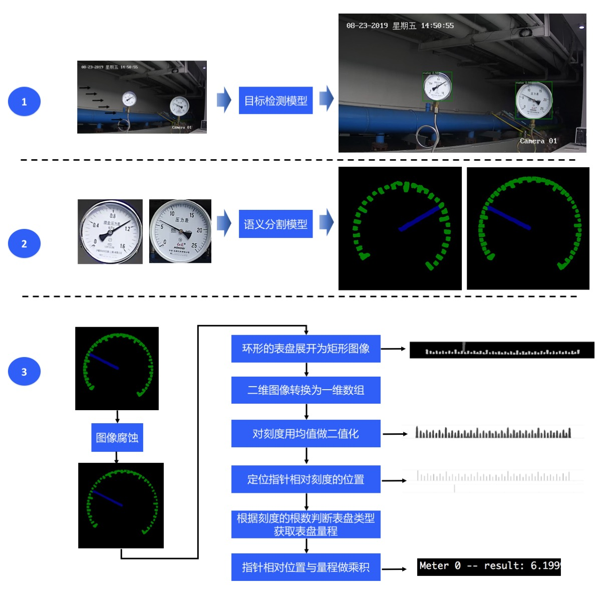
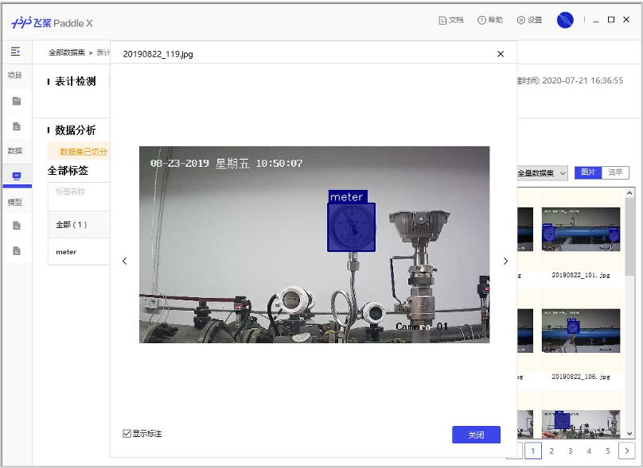
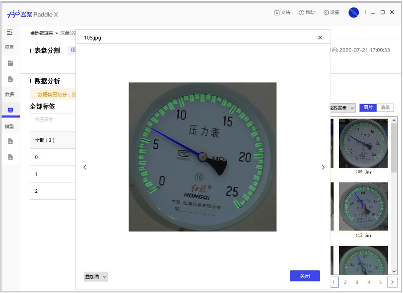

# 工业指针型表计读数

## 目录

* [1 项目说明](#1)
* [2 数据准备](#2)
* [3 模型选择](#3)
* [4 表计检测模型训练](#4)
* [5 指针和刻度分割模型训练](#5)
* [6 模型预测](#6)

## <h2 id="1">1 项目说明</h2>

在该项目中，主要向大家介绍如何使用目标检测和语义分割来实现对指针型表计读数。

在电力能源厂区需要定期监测表计读数，以保证设备正常运行及厂区安全。但厂区分布分散，人工巡检耗时长，无法实时监测表计，且部分工作环境危险导致人工巡检无法触达。针对上述问题，希望通过摄像头拍照->智能读数的方式高效地完成此任务。

<div align="center">
              </div>

为实现智能读数，我们采取目标检测->语义分割->读数后处理的方案：

* 第一步，使用目标检测模型定位出图像中的表计；
* 第二步，使用语义分割模型将各表计的指针和刻度分割出来；
* 第三步，根据指针的相对位置和预知的量程计算出各表计的读数。

整个方案的流程如下所示：

<div align="center">
              </div>


## <h2 id="2">2 数据准备</h2>

本案例开放了表计检测数据集、指针和刻度分割数据集、表计测试图片（只有图片无真值标注），使用这些图片可以完成目标检测模型、语义分割模型的训练、模型预测。点击下表中的链接可下载数据集，**提前下载数据集不是必须的，因为在接下来的模型训练部分中提供的训练脚本会自动下载数据集**。

| 表计测试图片                                                 | 表计检测数据集                                               | 指针和刻度分割数据集                                         |
| ------------------------------------------------------------ | ------------------------------------------------------------ | ------------------------------------------------------------ |
| [meter_test](https://bj.bcebos.com/paddlex/examples/meter_reader/datasets/meter_test.tar.gz) | [meter_det](https://bj.bcebos.com/paddlex/examples/meter_reader/datasets/meter_det.tar.gz) | [meter_seg](https://bj.bcebos.com/paddlex/examples/meter_reader/datasets/meter_seg.tar.gz) |

| 表计检测数据集 | 指针和刻度分割数据集 |
| -- | -- |
|  |  |


* 解压后的表计检测数据集的文件夹内容如下：

```
meter_det/
|-- annotations/ # 标注文件所在文件夹
|   |-- instance_train.json # 训练集标注文件
|   |-- instance_test.json # 测试集标注文件
|-- test/ # 测试图片所在文件夹
|   |-- 20190822_105.jpg # 测试集图片
|   |-- ... ...
|-- train/ # 训练图片所在文件夹
|   |-- 20190822_101.jpg # 训练集图片
|   |-- ... ...

```

* 解压后的指针和刻度分割数据集的文件夹内容如下：

```
meter_seg/
|-- annotations/ # 标注文件所在文件夹
|   |-- train # 训练集标注图片所在文件夹
|   |   |-- 105.png
|   |   |-- ... ...
|   |-- val # 验证集合标注图片所在文件夹
|   |   |-- 110.png
|   |   |-- ... ...
|-- images/ # 图片所在文件夹
|   |-- train # 训练集图片
|   |   |-- 105.jpg
|   |   |-- ... ...
|   |-- val # 验证集图片
|   |   |-- 110.jpg
|   |   |-- ... ...
|-- labels.txt # 类别名列表
|-- train.txt # 训练集图片列表
|-- val.txt # 验证集图片列表

```

* 解压后的表计测试图片的文件夹内容如下:
```
meter_test/
|-- 20190822_105.jpg
|-- 20190822_142.jpg
|-- ... ...
```

## <h2 id="3">3 模型选择</h2>

PaddleX提供了丰富的视觉模型，在目标检测中提供了RCNN和YOLO系列模型，在语义分割中提供了DeepLabV3P和BiSeNetV2等模型。

因最终部署场景是本地化的服务器GPU端，算力相对充足，因此在本项目中采用精度和预测性能的PPYOLOV2进行表计检测。

考虑到指针和刻度均为细小区域，我们采用精度更优的DeepLabV3P进行指针和刻度的分割。

## <h2 id="4">4 表计检测模型训练</h2>

本项目中采用精度和预测性能的PPYOLOV2进行表计检测。具体代码请参考[train_detection.py](./code/train_detection.py)。

运行如下代码开始训练模型：

```
python code/train_detection.py
```

* 训练过程说明

定义数据预处理 -> 定义数据集路径 -> 初始化模型 -> 模型训练

** 定义数据预处理

```
train_transforms = T.Compose([
    T.MixupImage(mixup_epoch=250), T.RandomDistort(),
    T.RandomExpand(im_padding_value=[123.675, 116.28, 103.53]), T.RandomCrop(),
    T.RandomHorizontalFlip(), T.BatchRandomResize(
        target_sizes=[320, 352, 384, 416, 448, 480, 512, 544, 576, 608],
        interp='RANDOM'), T.Normalize(
            mean=[0.485, 0.456, 0.406], std=[0.229, 0.224, 0.225])
])

eval_transforms = T.Compose([
    T.Resize(
        608, interp='CUBIC'), T.Normalize(
            mean=[0.485, 0.456, 0.406], std=[0.229, 0.224, 0.225])
])
```


** 定义数据集路径

```

# 下载和解压表计检测数据集，如果已经预先下载，可注视掉下面两行
meter_det_dataset = 'https://bj.bcebos.com/paddlex/examples/meter_reader/datasets/meter_det.tar.gz'
pdx.utils.download_and_decompress(meter_det_dataset, path='./')

train_dataset = pdx.datasets.CocoDetection(
    data_dir='meter_det/train/',
    ann_file='meter_det/annotations/instance_train.json',
    transforms=train_transforms,
    shuffle=True)
eval_dataset = pdx.datasets.CocoDetection(
    data_dir='meter_det/test/',
    ann_file='meter_det/annotations/instance_test.json',
    transforms=eval_transforms)
```

** 初始化模型

```
num_classes = len(train_dataset.labels)
model = pdx.models.PPYOLOv2(
    num_classes=num_classes, backbone='ResNet50_vd_dcn')

```

** 模型训练

```
model.train(
    num_epochs=170,
    train_dataset=train_dataset,
    train_batch_size=8,
    eval_dataset=eval_dataset,
    pretrain_weights='COCO',
    learning_rate=0.005 / 12,
    warmup_steps=1000,
    warmup_start_lr=0.0,
    lr_decay_epochs=[105, 135, 150],
    save_interval_epochs=5,
    save_dir='output/ppyolov2_r50vd_dcn',
    use_vdl=True)
```

## <h2 id="5">5 指针和刻度分割模型训练</h2>

本项目中采用精度更优的DeepLabV3P进行指针和刻度的分割。具体代码请参考[train_segmentation.py](./code/train_segmentation.py)。

运行如下代码开始训练模型：

```
python code/train_segmentation.py
```

* 训练过程说明

定义数据预处理 -> 定义数据集路径 -> 初始化模型 -> 模型训练

** 定义数据预处理

```
train_transforms = T.Compose([
    T.Resize(target_size=512),
    T.RandomHorizontalFlip(),
    T.Normalize(
        mean=[0.5, 0.5, 0.5], std=[0.5, 0.5, 0.5]),
])

eval_transforms = T.Compose([
    T.Resize(target_size=512),
    T.Normalize(
        mean=[0.5, 0.5, 0.5], std=[0.5, 0.5, 0.5]),
])
```


** 定义数据集路径

```
# 下载和解压指针刻度分割数据集，如果已经预先下载，可注视掉下面两行
meter_seg_dataset = 'https://bj.bcebos.com/paddlex/examples/meter_reader/datasets/meter_seg.tar.gz'
pdx.utils.download_and_decompress(meter_seg_dataset, path='./')

train_dataset = pdx.datasets.SegDataset(
    data_dir='meter_seg',
    file_list='meter_seg/train.txt',
    label_list='meter_seg/labels.txt',
    transforms=train_transforms,
    shuffle=True)

eval_dataset = pdx.datasets.SegDataset(
    data_dir='meter_seg',
    file_list='meter_seg/val.txt',
    label_list='meter_seg/labels.txt',
    transforms=eval_transforms,
    shuffle=False)

```

** 初始化模型

```
num_classes = len(train_dataset.labels)
model = pdx.models.DeepLabV3P(num_classes=num_classes, backbone='ResNet50_vd', use_mixed_loss=True)

```

** 模型训练

```
model.train(
    num_epochs=20,
    train_dataset=train_dataset,
    train_batch_size=4,
    pretrain_weights='IMAGENET',
    eval_dataset=eval_dataset,
    learning_rate=0.1,
    save_dir='output/deeplabv3p_r50vd')
```

## <h2 id="6">6 模型预测</h2>

运行如下代码：

```
python code/reader_infer.py --det_model_dir output/ppyolov2_r50vd_dcn/best_model --seg_model_dir output/deeplabv3p_r50vd/best_model/ --image meter_det/test/20190822_105.jpg
```

则会在终端上输出信息：

```
Meter 1: 6.299999866666726
Meter 2: 1.1057142840816332
2021-06-26 12:17:14 [INFO]  The visualized result is saved at ./output/result/visualize_1624709834720.jpg

```
预测结果如下：

<div align="center">
              </div>

我们看下预测代码中的预测流程：

图像解码 —> 检测表计 -> 过滤检测框 -> 提取检测框所在图像区域 -> 图像缩放 -> 指针和刻度分割 -> 读数后处理 -> 打印读数 -> 可视化预测结果

```
def predict(self,
                img_file,
                save_dir='./',
                use_erode=True,
                erode_kernel=4,
                score_threshold=0.5,
                seg_batch_size=2):
    """检测图像中的表盘，而后分割出各表盘中的指针和刻度，对分割结果进行读数后厨后得到各表盘的读数。


        参数：
            img_file (str)：待预测的图片路径。
            save_dir (str): 可视化结果的保存路径。
            use_erode (bool, optional): 是否对分割预测结果做图像腐蚀。默认值：True。
            erode_kernel (int, optional): 图像腐蚀的卷积核大小。默认值: 4。
            score_threshold (float, optional): 用于滤除检测框的置信度阈值。默认值：0.5。
            seg_batch_size (int, optional)：分割模型前向推理一次时输入表盘图像的批量大小。默认值为：2。
    """

    img = self.decode(img_file)
    det_results = self.detector.predict(img)
    filtered_results = self.filter_bboxes(det_results, score_threshold)
    sub_imgs = self.roi_crop(img, filtered_results)
    sub_imgs = self.resize(sub_imgs, METER_SHAPE)
    seg_results = self.seg_predict(self.segmenter, sub_imgs, seg_batch_size)
    seg_results = self.erode(seg_results, erode_kernel)
    meter_readings = self.get_meter_reading(seg_results)
    self.print_meter_readings(meter_readings)
    self.visualize(img, filtered_results, meter_readings, save_dir)

```
