# 兼容并包的PaddleX-Inference部署方式

在新版本的PaddleX中，对于CPP的部署代码方式做了非常大的变化：
* 支持用户将PaddleDetection PaddleSeg PaddleClas训练出来的模型通过一套部署代码实现快速部署，实现了多个模型的打通。
* 对于一个视觉任务里面既有检测，又有分割来说，极大的简化了使用的流程。
* 提供了更好用的tensorRT加速的使用方式。

下面我们具体以Windows系统为例，基于PaddleX的这套CPP，说明一下如何实现工业化的部署（trt加速）

项目使用环境说明：

* CUDA10.2  Cudnn 7.6
* opencv版本3.4.6
* PaddleInference 10.2的预测库
* TensorRT 7.0.0
* Cmake 3.5
* VS2019 社区版

 ## 1 环境准备

* 下载好PaddleX代码和PaddleInference预测库
* 下载Tensorrt，并设置系统环境变量
在本项目中使用的cuda版本是10.2，下载对应的trt版本
* 为了便于项目管理，将所有的文件汇总到一个文件夹中

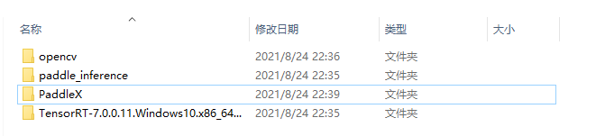              

* 设置OpenCV系统环境变量

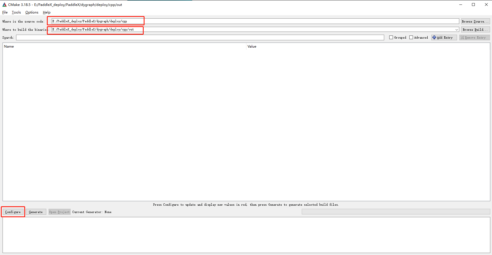              

## 2 代码编译

* 使用Cmake进行编译，我们主要对`PaddleX/deploy/cpp`中代码进行编译，并创建`out`文件夹用来承接编译生成的内容，

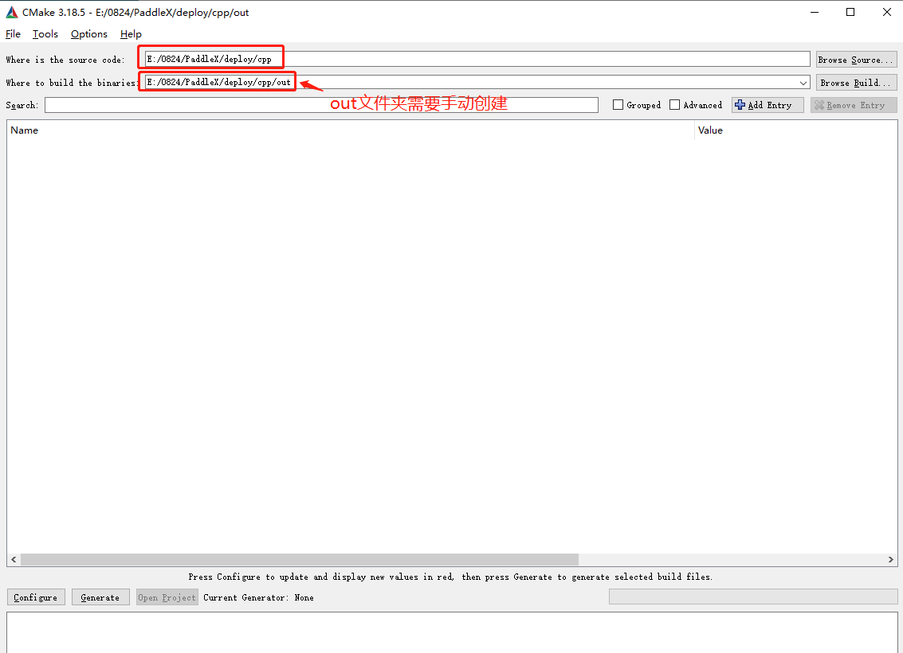              

* 点击Configure进行选项

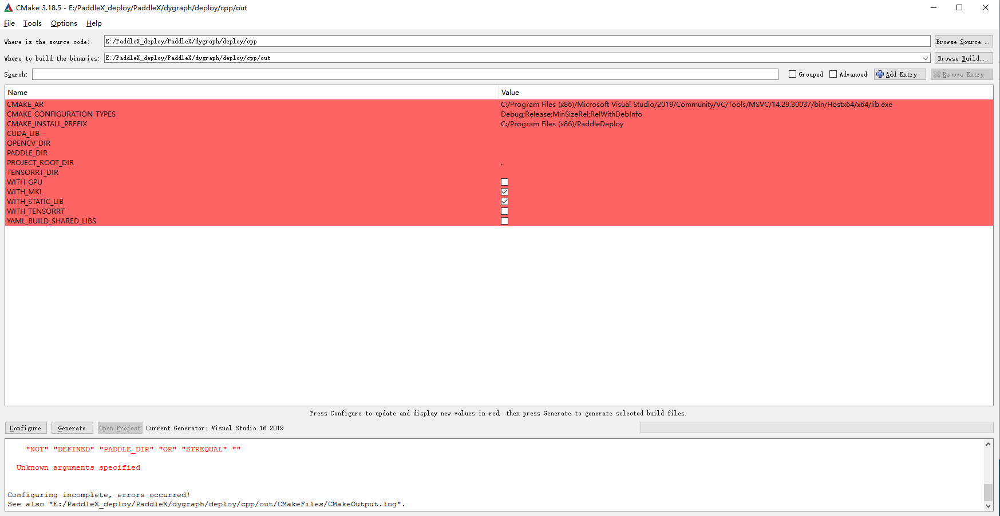              

* 选择X64，并点击finish

              

* 点击Generate进行生成，此时生成失败，

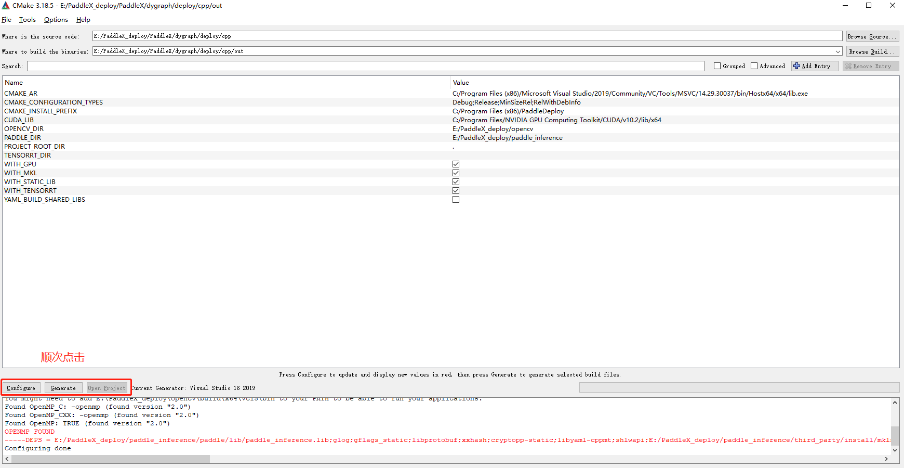              

* 用户在这里补充opencv tensorrt paddle预测库，cuda的lib库的路径，并且勾选WITH_GPU  WITH_MKL WITH_TENSORRT 几项然后重新进行生成

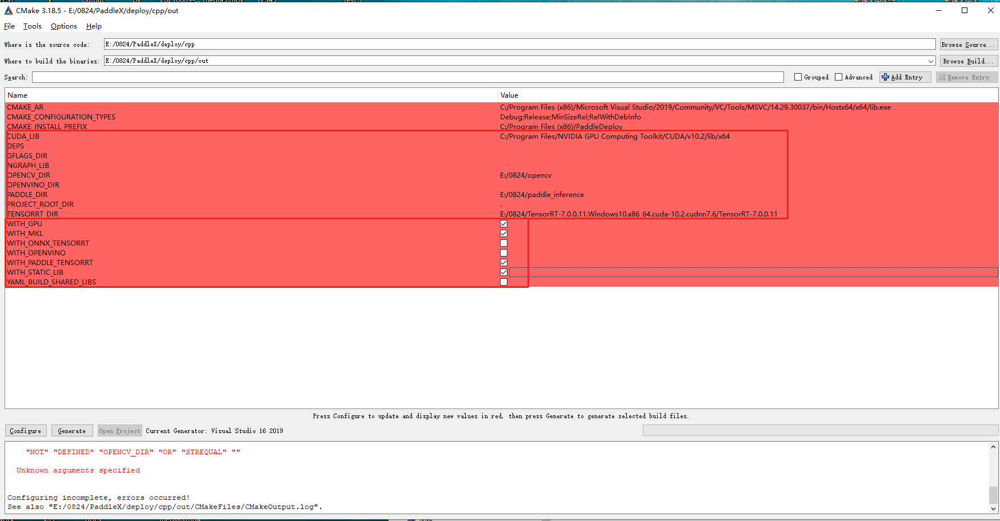              

* 最终在out文件夹中出现了.sln文件，则表示通过cmake生成成功了解决方案

* 打开sln文件，会发现在PaddleDeploy目录下生成了7个项目，其中关键的是

`batch_infer`

`model_infer`

`multi_gpu_model_infer`

 `tensorrt_infer`

              

## 3 生成dll

### 3.1 修改cmakelists

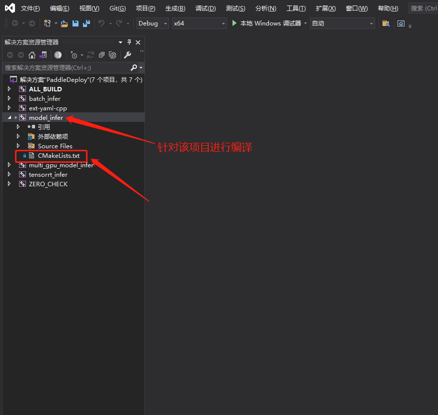             

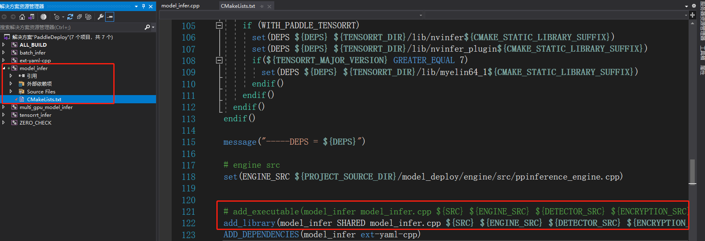             

### 3.2 修改model_infer.cpp并重新生成dll

* 修改后的model_infer.cpp已经提供，请用paddleX/examples/C#_deploy/model_infer.cpp文件替换PaddleX/deploy/cpp/demo/model_infer.cpp

### 3.3 创建一个c#项目并调用dll

* 目前已经给出了C#项目，支持PaddleX PaddleClas PaddleDetection PaddleSeg的模型去预测，为了方便大家使用，提供了在单张图片/多张图片/视频流预测形式。支持实时显示预测时间，支持预测GPU和CPU分别预测。
* 用户只需要运行.sln文件即可呈现如下文件形式：

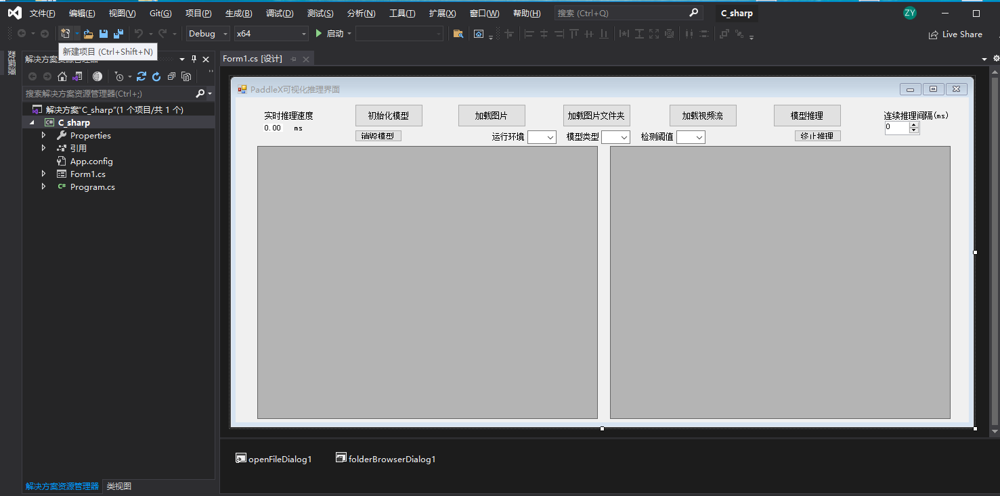             

* 用户选择Debug X64模式进行调式

* 用户在使用预测之前需要自行下载opencvsharp
方式：工具-NuGet包管理工具器，选择搜索下载opencvcharp

             

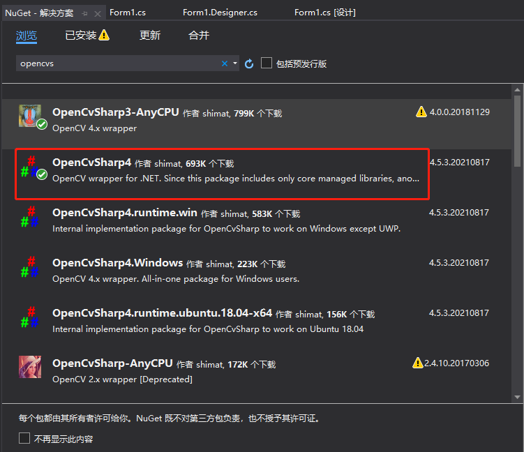             

* 此外需保证在C#项目的bin\x64\Debug\net5.0-windows下包含以下dll，再进行预测推理
 
  - opencv_world346.dll, 位于下载的opencv文件夹: opencv\build\x64\vc15\bin
  - model_infer.dll, 位于上边cmkae编译的目录下: PaddleX\deploy\cpp\out\paddle_deploy\Release
  - 其余dll, 位于以下目录: PaddleX\deploy\cpp\out\paddle_deploy
  - opencvsharp的dll，只需按照上边安装下载即可自动加载到该目录下

             

* 如下为预测结果显示

分类：

             

目标检测：

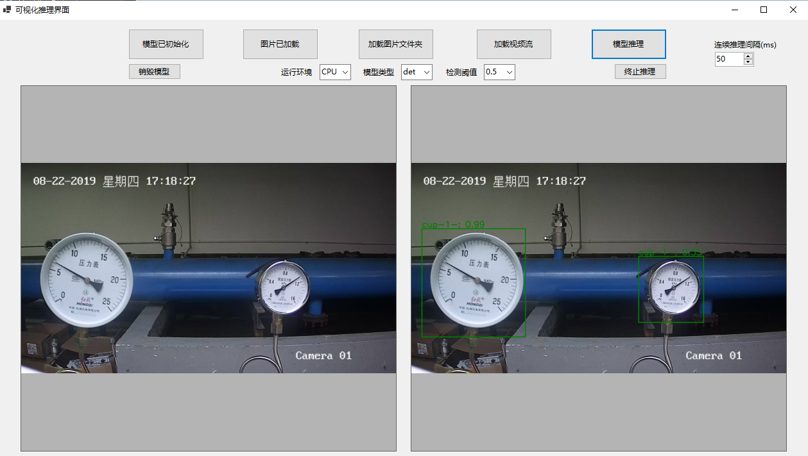             

语义分割：

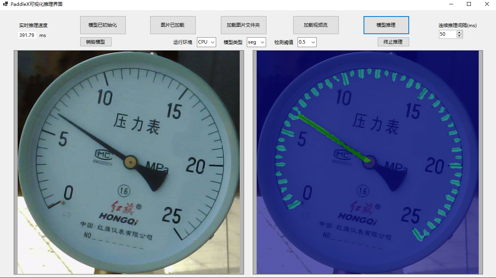             

MaskRCNN实例分割：

             

### 3.4 c#项目:可视化界面功能简要描述

- 1.可加载PaddleSeg, PaddleClas, PaddleDetection以及PaddleX导出的部署模型, 分别对应模型选择中的: seg, clas, det, paddlex
- 2.目前也支持GPU下加载MaskRCNN进行实例分割可视化推理，需选择模型: mask
- 3.支持CPU与GPU推理，同时支持指定GPU运行 —— 当前在单卡上测试默认为0运行正常，非法指定不存在的id无法初始化模型；且可能引发异常导致程序崩溃
- 4.支持单张图片(png, jpg)、图片文件夹、视频流(mp4)推理
- 5.支持目标检测时，设定检测结果显示阈值
- 6.支持图片文件夹推理时，设定连续推理间隔，方便观察预测效果
- 7.支持推理中断：及图片文件夹推理过程+视频流推理过程

### 3.5 可视化界面基本使用说明

- 1.选择模型类型:det、seg、clas、mask、paddlex
- 2.选择运行环境:CPU、GPU
- 3.点击初始化模型，选择模型文件夹即可 —— 文件夹格式如下
   - inference_model
       - *.yml
       - *.pdmodel
       - *.pdiparams
       - paddlex的模型含有两个yml，其余套件导出只有一个yml/yaml
- 4.加载图片/图片文件夹/视频流
- 5.模型推理
- 6.执行提前推理中断
- 7.加载新模型，如果在同一环境下运行且属于同一模型类型，则点击模型加载按钮即可进行新模型的初始化
- 8.如果运行环境或模型类型不一致，需要先点击销毁模型，然后再设置模型类型以及运行环境，最后重新初始化新模型
- 9.在目标检测过程中，可设置检测阈值
- 10.在文件夹推理过程中，可设置连续推理间隔时间
- 11.可通过查看左上角实时推理耗时来查看模型预处理+推理-后处理的时间
- 12.可编辑GPU_id，设置初始化时模型运行在指定GPU上——请根据实际硬件设置，默认为0

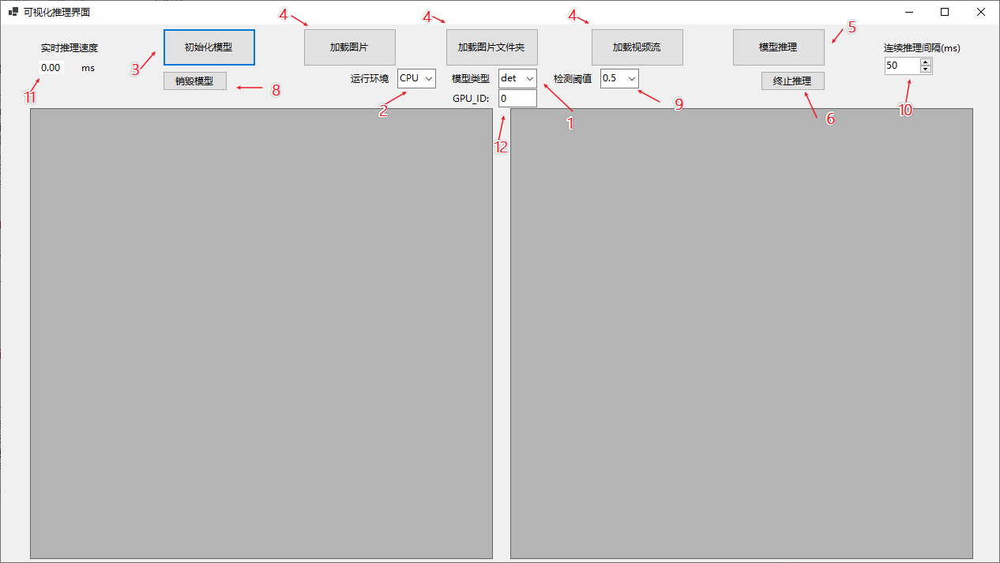             

### 3.6 C#项目模型推理/数据流向简要说明

* 图像识别流程

             

* 目标检测流程

             

* 语义分割流程

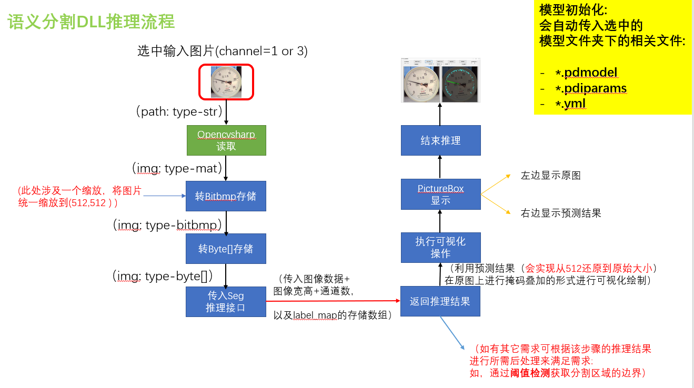             

* 实例分割流程(MaskRCNN)

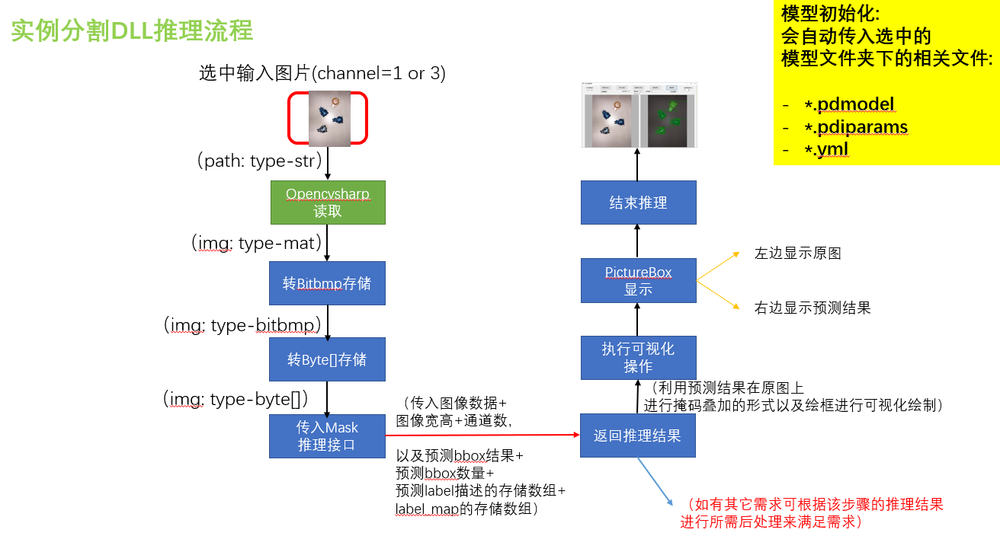             

> 该流程在任何模型类型下都是成立的，只是det类型只对应目标检测流程，seg类型只对应语义分割流程， clas类型只对应图像识别流程， mask类型只对应实例分割流程(MaskRCNN)。
> 在paddlex类型下时，底层也是自动转为det、seg、clas类型进行实现的。
