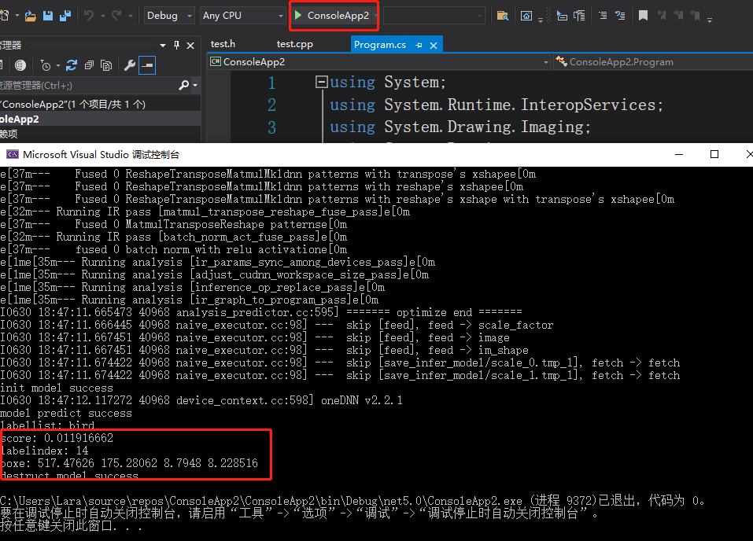

# 兼容并包的PaddleX-Inference部署方式

在新版本的PaddleX中，对于CPP的部署代码方式做了非常大的变化：
* 支持用户将PaddleDetection PaddleSeg PaddleClas训练出来的模型通过一套部署代码实现快速部署，实现了多个模型的打通。
* 对于一个视觉任务里面既有检测，又有分割来说，极大的简化了使用的流程。
* 提供了更好用的tensorRT加速的使用方式。


下面我们具体以Windows系统为例，基于PaddleX的这套CPP，说明一下如何实现工业化的部署（trt加速）

项目使用环境说明：

* CUDA10.2  Cudnn 7.6
* opencv版本3.4.6
* PaddleInference 10.2的预测库
* TensorRT 7.0.0
* Cmake 3.5
* VS2019 社区版


 ## 1 环境准备

* 下载[opencv](https://bj.bcebos.com/paddleseg/deploy/opencv-3.4.6-vc14_vc15.exe)，并设置系统环境变量

<div align="center">
              </div>

* 下载Tensorrt，并设置系统环境变量
在本项目中使用的cuda版本是10.2，下载对应的trt版本


<div align="center">
              </div>


## 2 代码编译
下载好PaddleX代码

```
git clone https://github.com/PaddlePaddle/PaddleX
cd dygraph
```


使用Cmake进行编译，我们主要对`PaddleX/dygraph/deploy/cpp`中代码进行编译，并创建`out`文件夹用来承接编译生成的内容，

<div align="center">
              </div>

点击Configure进行选项筛选，并选择X64一项，并点击finish
<div align="center">
              </div>
在运行上述步骤后，出现报错，并在空白区域出现待补充的内容。
<div align="center">
              </div>

用户在这里补充opencv tensorrt paddle预测库，cuda的lib库的路径，并且勾选WITH_GPU  WITH_MKL WITH_TENSORRT 几项然后重新进行生成
<div align="center">
              </div>
依次点击修改

<div align="center">
              </div>
最终在out文件夹中出现了.sln文件，则表示通过cmake生成成功了解决方案
<div align="center">
              </div>
打开sln文件，会发现在PaddleDeploy目录下生成了7个项目，其中关键的是

`batch_infer`

`model_infer`

`multi_gpu_model_infer`

 `tensorrt_infer`

<div align="center">
              </div>

## 3 生成dll

### 3.1 修改cmakelists
<div align="center">
             </div>


### 3.2 修改model_infer.cpp并重新生成dll

* 修改后的model_infer.cpp已经提供，位于[model_infer.cpp](./model_infer.cpp)。请将[model_infer.cpp](./model_infer.cpp)替换[deploy/cpp/demodeploy/cpp/demo](https://github.com/PaddlePaddle/PaddleX/tree/develop/dygraph/deploy/cpp/demo)中的model_infer.cpp，或者参考[model_infer.cpp](./model_infer.cpp)修改自己的model_infer.cpp。

### 3.3 创建一个c#项目并调用dll

默认已经创建好了一个c#项目。

* 将前面生成的dll拷贝到C#项目中

<div align="center">
             </div>

* 3.4 执行C#项目去预测

C#项目中的Program.cs代码已经提供，位于[Program.cs](Program.cs)。执行运行后得到预测结果如下：

<div align="center">
             </div>
