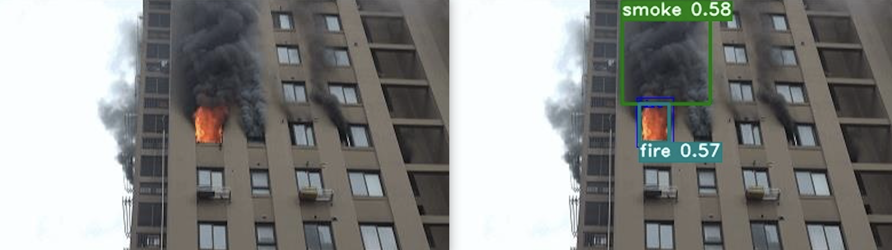
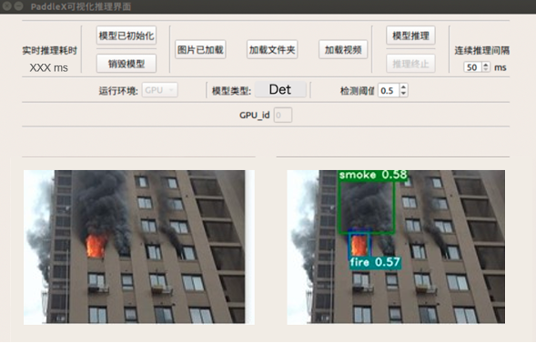

# 火灾烟雾检测

## 内容

* [项目说明](#项目说明)
* [安装说明](#安装说明)
* [数据准备](#数据准备)
* [模型选择](#模型选择)
* [模型训练](#模型训练)
* [模型评估](#模型评估)
* [模型预测](#模型预测)
* [模型导出](#模型导出)
* [模型推理](#模型推理)
* [模型优化](#模型优化)
* [模型部署](#模型部署)

<a name="项目说明"></a>

## 1 项目说明

针对住宅、加油站、公路、森林等火灾高发场景，应用飞桨[PaddleX](https://github.com/PaddlePaddle/PaddleX/tree/develop)的目标检测技术，可以自动检测监控区域内的烟雾和火灾，帮助相关人员及时应对，最大程度降低人员伤亡及财物损失，模型效果如图1所示。希望通过梳理优化模型精度和性能的思路能帮助用户更高效地解决实际火灾和烟雾检测应用中的问题。开放烟雾和火灾数据和预训练模型，并提供服务器Serving和Jetson NX边缘侧芯片的部署指南。



**方案难点**：

- **推理速度要求高：** 在烟雾和火灾检测场景，希望模型能在火情发生的第一时间即做出响应，对模型推理速度有较高的要求；

- **干扰样本多，容易造成误检：** 生活中有很多物体和烟火是非常接近的，很难区分（比如：云朵、红色的灯光等），容易造成模型误检。

  注：AI Studio在线运行代码请参考[【产业级应用案例】火灾/烟雾检测](https://aistudio.baidu.com/aistudio/projectdetail/2503301?contributionType=1)(配备Tesla V100高级算力资源)。

<a name="安装说明"></a>

## 2 安装说明

#### 环境要求

* PaddlePaddle >= 2.1.0
* Python >= 3.5
* PaddleX >= 2.0.0

安装的相关问题参考[PaddleX安装](https://paddlex.readthedocs.io/zh_CN/release-1.3/install.html#pip)

#### 下载PaddleX源码

```
git clone https://github.com/PaddlePaddle/PaddleX -b develop
cd PaddleX
git checkout develop
```

<a name="数据准备"></a>

## 3 数据准备

---

本案例使用数据集包含[MIT协议互联网下载图片](https://github.com/gengyanlei/fire-smoke-detect-yolov4  )和[MIT协议公开数据集](https://aistudio.baidu.com/aistudio/datasetdetail/90352/0)，共有6675张图片，分别检测烟雾和火灾，示例图片如下图所示：


数据集图片格式是VOC数据格式，VOC数据是每个图像文件对应一个同名的xml文件，xml文件内包含对应图片的基本信息，比如文件名、来源、图像尺寸以及图像中包含的物体区域信息和类别信息等。

xml文件中包含以下字段：

- filename，表示图像名称。

- size，表示图像尺寸。包括：图像宽度、图像高度、图像深度。

  ```
  <size>
      <width>500</width>
      <height>375</height>
      <depth>3</depth>
  </size>
  ```

- object字段，表示每个物体。包括:

  |     标签     |                             说明                             |
  | :----------: | :----------------------------------------------------------: |
  |     name     |                         物体类别名称                         |
  |     pose     |              关于目标物体姿态描述（非必须字段）              |
  |  truncated   | 如果物体的遮挡超过15-20％并且位于边界框之外，请标记为`truncated`（非必须字段） |
  |  difficult   |        难以识别的物体标记为`difficult`（非必须字段）         |
  | bndbox子标签 |       (xmin,ymin) 左上角坐标，(xmax,ymax) 右下角坐标，       |

将这6675张图片按9:1比例随机切分，切分后包含6008张图片的训练集和667张图片的验证集，提供处理好的数据集，[下载地址](https://aistudio.baidu.com/aistudio/datasetdetail/107770)。包含以下文件夹和文件：`images`,`annotations`,`labels.txt`, `train_list.txt`和 `val_list.txt`，分别图片、xml标注文件、存储类别信息、训练样本列表、验证样本列表。训练样本列表和验证样本列表的每一行格式为：`图片路径 对应的xml路径`，例如`images/fire_00348.jpg annotations/fire_00348.xml`。

最终数据集文件组织结构为：

```
 ├── dataset
	├── annotations
  │   ├── fire_000001.xml
  │   ├── fire_000002.xml
  │   ├── fire_000003.xml
  │   |   ...
  ├── images
  │   ├── fire_000001.jpg
  │   ├── fire_000003.jpg
  │   ├── fire_000003.jpg
  │   |   ...
  ├── label_list.txt
  ├── train.txt
  └── valid.txt
```

<a name="模型选择"></a>

##  模型选择

PaddleX提供了5种目标检测模型：FasterRCNN、YOLOv3、PP-YOLO、PP-YOLOv2和PP-YOLO-tiny。

* [Faster RCNN](https://arxiv.org/pdf/1506.01497.pdf)：Ross B. Girshick在2016年提出了新的FasterRCNN，需要先产生候选区域，再对RoI做分类和位置坐标的预测，这类算法被称为两阶段目标检测算法。在结构上，Faster RCNN已经将特征抽取(feature extraction)，proposal提取，bounding box regression(rect refine)，classification都整合在了一个网络中，使得综合性能有较大提高，在检测速度方面尤为明显。
* [YOLOv3](https://pjreddie.com/media/files/papers/YOLOv3.pdf)：Joseph Redmon等人在2015年提出YOLO（You Only Look Once，YOLO）算法，通常也被称为YOLOv1；2016年，他们对算法进行改进，又提出YOLOv2版本；2018年发展出YOLOv3版本。YOLOv3使用单个网络结构，在产生候选区域的同时即可预测出物体类别和位置，这类算法被称为单阶段目标检测算法。另外，YOLOv3算法产生的预测框数目比Faster R-CNN少很多。Faster R-CNN中每个真实框可能对应多个标签为正的候选区域，而YOLOv3里面每个真实框只对应一个正的候选区域。这些特性使得YOLOv3算法具有更快的速度，能到达实时响应的水平。
* [PP-YOLO](https://arxiv.org/abs/2007.12099)：PP-YOLO是[PaddleDetection]()优化和改进的YOLOv3的模型，在[COCO](http://cocodataset.org/) test-dev2017数据集上精度达到45.9%，在单卡V100上FP32推理速度为72.9 FPS，V100上开启TensorRT下FP16推理速度为155.6 FPS。PP-YOLO从如下方面优化：
  - 更优的骨干网络: ResNet50vd-DCN
  - 更大的训练batch size: 8 GPUs，每GPU batch_size=24，对应调整学习率和迭代轮数
  - [Drop Block](https://arxiv.org/abs/1810.12890)
  - [Exponential Moving Average](https://www.investopedia.com/terms/e/ema.asp)
  - [IoU Loss](https://arxiv.org/pdf/1902.09630.pdf)
  - [Grid Sensitive](https://arxiv.org/abs/2004.10934)
  - [Matrix NMS](https://arxiv.org/pdf/2003.10152.pdf)
  - [CoordConv](https://arxiv.org/abs/1807.03247)
  - [Spatial Pyramid Pooling](https://arxiv.org/abs/1406.4729)
  - 更优的预训练模型

* [PP-YOLOv2](https://arxiv.org/abs/2104.10419)：相较20年发布的PP-YOLO，PP-YOLOv2版本在COCO 2017 test-dev上的精度提升了3.6个百分点，由45.9%提升到了49.5%；在640*640的输入尺寸下，FPS达到68.9FPS。 主要改进点：
  * Path Aggregation Network
  * Mish Activation Function
  * Larger Input Size
  * IoU Aware Branch
* PP-YOLO-tiny：在当前移动互联网、物联网、车联网等行业迅猛发展的背景下，边缘设备上直接部署目标检测的需求越来越旺盛。生产线上往往需要在极低硬件成本的硬件例如树莓派、FPGA、K210 等芯片上部署目标检测算法。而我们常用的手机 App，也很难直接在终端采用超过 6M 的深度学习算法。如何在尽量不损失精度的前提下，获得体积更小、运算速度更快的算法呢？得益于 PaddleSlim 飞桨模型压缩工具的能力，体积仅为 1.3M 的 PP-YOLO-tiny 诞生了！PP-YOLO-tiny 沿用了 PP-YOLO 系列模型的 spp，iou loss, drop block, mixup, sync bn 等优化方法，并进一步采用了针对移动端的优化策略：
  * 更适用于移动端的骨干网络：MobileNetV3
  * 更适用移动端的检测头（head）：深度可分离卷积
  * 去除对模型体积、速度有显著影响的优化策略：iou aware、matrix NMS等
  * 使用更小的输入尺寸
  * 召回率优化
  * 更大的batch size
  * 量化后压缩

根据部署场景以及烟火检测实时性、高召回低误检要求，这里我们选择了PP-YOLOv2算法进行火灾和烟雾检测。

<a name="模型训练"></a>

## 5 模型训练

本项目采用PP-YOLOv2作为烟火检测的模型，模型训练需要经过如下环节：


具体代码请参考[train.py](code/train.py)，可修改参数：

* train_transforms：训练预处理参数，可以增加、修改预处理方法和参数；
* eval_transforms：验证预处理参数，可以增加、修改预处理方法和参数；
* train_dataset：训练使用数据集，修改图片路径、标签路径以及是否进行数据shuffle；
* eval_dataset：验证使用数据集，修改图片路径、标签路径以及是否进行数据shuffle；
* pdx.models.*：设置不同的模型，可选[FasterRCNN、YOLOv3、PP-YOLO、PP-YOLO-tiny、PP-YOLOv2，这里选择PP-YOLOv2；
* model.train：设置训练epoch、训练和验证数据集、batch size、学习率learning rate、warmup step、lr衰减lr_decay_epoch、模型保存间隔save_interval_epoch、模型保存路径save_dir，详细介绍[训练参数](https://github.com/PaddlePaddle/PaddleX/blob/develop/docs/apis/models/detection.md)。

PaddleX提供了单卡/多卡训练模型，满足用户多种训练需求

* GPU单卡训练

```
export CUDA_VISIBLE_DEVICES=0 #windows和Mac下不需要执行该命令
python 1.train_ppyolov2_imagenet.py
```

* GPU多卡训练，例如使用2张卡时执行：

```
export CUDA_VISIBLE_DEVICES=0,1 #windows和Mac下不需要执行该命令
python -m paddle.distributed.launch --gpus 0,1 1.train_ppyolov2_imagenet.py
```

<a name="模型评估"></a>

## 6 模型评估

因为采用多个数据集一起训练，每个数据集标注方式不同，如下图左数据集A将火标注为一个检测框，但是下图右数据集B又将火标注为多个检测框。

<div align="center">
  
</div>  

不同的标注方式就导致训练好的模型，无法有效的计算mAP值。我们可以通过下图从两方面分析：

* 蓝色框表示真实标注框，可以看出有很多小检测框。实际评估时，火灾只有2个绿色检测框，能正确检测火灾，但没能和真实框一一对应，如果使用mAP作为指标，就不能正确反映检测效果。
* 有些数据集没标注烟雾，但是可以检测到烟雾，同样mAP也不能正确反映检测效果。

<div align="center">
  
  </div>

综上，我们计算不同置信度阈值下图片级召回率和图片级误检率，找到符合要求的召回率和误检率，对应的置信度阈值用于后续模型预测阶段。使用PP-YOLOv2训练好的模型进行评估，运行下行命令即可：

```
python eval.py
```

得到PP-YOLOv2烟雾和火灾检测指标，召回相对达到预期，但是召回比较高，后续我们将一起探究如何降低误检率：

| 模型               | 召回率/% | 误检率/% |
| ------------------ | -------- | -------- |
| PP-YOLOv2+ResNet50 | 95.1     | 23.22    |

【名词解释】

* 图片级别的召回率：只要在有目标的图片上检测出目标（不论框的个数），该图片被认为召回。批量有目标图片中被召回图片所占的比例，即为图片级别的召回率。
* 图片级别的误检率：只要在无目标的图片上检测出目标（不论框的个数），该图片被认为误检。批量无目标图片中被误检图片所占的比例，即为图片级别的误检率。

<a name="模型预测"></a>

## 7 模型预测

加载训练好的模型，置信度阈值设置为0.4，执行下行命令对验证集或测试集图片进行预测：

```
python predict.py
```

可视化预测结果示例如下，可以看出室内的火灾也可以有效检测出来：

<div align="center">
 
   </div>

注：图片来源于互联网，侵权删稿

<a name="模型导出"></a>

## 8 模型导出

在模型训练过程中保存的模型文件是包含前向预测和反向传播的过程，在实际的工业部署则不需要反向传播，因此需要将模型进行导成部署需要的模型格式。 执行下面命令，即可导出模型

```
paddlex --export_inference --model_dir=./output/deeplabv3p_r50vd/best_model/ --save_dir=./inference_model
```

预测模型会导出到`inference_model/`目录下，包括`model.pdmodel`、`model.pdiparams`、`model.pdiparams.info`、`model.yml`和`pipeline.yml`五个文件，分别表示模型的网络结构、模型权重、模型权重名称、模型的配置文件（包括数据预处理参数等）和可用于[PaddleX Manufacture SDK](https://github.com/PaddlePaddle/PaddleX/tree/release/2.0.0/deploy/cpp/docs/manufacture_sdk)的流程配置文件。

* 更多关于模型导出的文档，请参考[模型导出文档](https://github.com/PaddlePaddle/PaddleX/blob/release/2.0.0/docs/apis/export_model.md)

<a name="模型推理"></a>

## 9 模型推理

接下来使用PaddleX python高性能预测接口，在终端输入以下代码即可，同时可以通过以下代码进行速度预测：

```python
import paddlex as pdx
predictor = pdx.deploy.Predictor('./inference_model')
result = predictor.predict(img_file='test_imgs/test.jpg',
                           warmup_iters=100,
                           repeats=100)
```

或执行下面命令：

```
python infer.py
```

**关于预测速度的说明**：加载模型后，前几张图片的预测速度会较慢，这是因为运行启动时涉及到内存显存初始化等步骤，通常在预测20-30张图片后模型的预测速度达到稳定。**如果需要评估预测速度，可通过指定预热轮数warmup_iters完成预热**。**为获得更加精准的预测速度，可指定repeats重复预测后取时间平均值**。

<a name="模型优化"></a>

## 10 模型优化

本小节侧重展示在模型迭代过程中优化精度的思路，在本案例中，有些优化策略获得了精度收益，而有些没有。在其他质检场景中，可根据实际情况尝试这些优化策略，具体请参考[模型优化文档](./accuracy_improvement.md)

#### 10.1 模型优化策略

* 修改图片尺寸：数据处理时，可修改`target_size`为480、608、640等

* 数据增强：数据处理时，使用不同的预处理、增强方法组合，包含：RandomHorizontalFlip、RandomDistort 、 RandomCrop 、RandomExpand、MixupImage等，详细解释请参考[图像预处理/增强](https://github.com/PaddlePaddle/PaddleX/blob/develop/docs/apis/transforms/transforms.md)

* 不同模型：两阶段(Faster RCNN)、单阶段(YOLOv3、PP-YOLO、PP-YOLOv2等)

* 不同backbone：ResNet50、ResNet101、DarkNet53、MobileNet3，具体每个模型可选参数，可参考检测模型文件[https://github.com/PaddlePaddle/PaddleX/blob/develop/paddlex/cv/models/detector.py]每个模型的backbone，如YOLOv3，就表示这些模型可以作为YOLOv3的backbone：

  ```python
      if backbone not in [
              'MobileNetV1', 'MobileNetV1_ssld', 'MobileNetV3',
              'MobileNetV3_ssld', 'DarkNet53', 'ResNet50_vd_dcn', 'ResNet34'
      ]:
  ```

* 是否加DCN(Deformable Convolution Network，可变形卷积)：FasterRCNN通过设置[with_dcn=True](https://github.com/PaddlePaddle/PaddleX/blob/326eebd56308704939b088bc0807a950497a33f6/paddlex/cv/models/detector.py#L744)使用可变性卷积

* 加入背景图片：当误检较高时，可以考虑使用[add_negative_samples](https://github.com/PaddlePaddle/PaddleX/blob/bf1ef2894a787593c66d87b361d3a3bf05b6d036/paddlex/cv/datasets/voc.py#L371)API加入背景图片作为负样本进行训练，只需一行代码即可，image_dir表示负样本路径：

  `train_dataset.add_negative_samples(image_dir='./dataset/train_neg')`

* [训练参数调整](https://github.com/PaddlePaddle/PaddleX/blob/develop/docs/parameters.md)

#### 10.2 推理时间计算方式

采用PaddleX在单卡Tesla V100上测试模型的推理时间（输入数据拷贝至GPU的时间、计算时间、数据拷贝至CPU的时间），推理时间取**100次推理取平均耗时**，即[9 模型推理](#模型推理)`repeats`参数设置为100。

#### 10.3 不同模型结果

| 序号 | 模型                                                | 推理时间（FPS） | Recall | Error Rate |
| ---- | --------------------------------------------------- | --------------- | ------ | ---------- |
| 1    | **PP-YOLOv2**+ResNet50+ImageNet预训练(**Baseline**) | **24**          | 95.1   | 23.22      |
| 2    | **PP-YOLOv2**+ResNet50+ImageNet预训练+**aug**       | -               | 94.1   | 14.9       |
| 3    | **PP-YOLOv2**+ResNet50+**COCO预训练**               | -               | 97.4   | 28.6       |
| 4    | **PP-YOLOv2**+ResNet50+COCO预训练+**aug**           | -               | 96.3   | 11.1       |
| 5    | **PP-YOLOv2**+ResNet50+COCO预训练+aug+**SPP=False** | -               | 96     | 13.21      |
| 6    | **PP-YOLOv2**+ResNet50+aug+COCO预训练+**背景图**    | **23.6**        | 93.9   | 1.1        |
| 7    | **PP-YOLOv2**+**ResNet101**+aug+COCO预训练+背景图   | 21              | **96** | **2.2**    |
| 8    | **PP-YOLO**+ResNet50+COCO预训练+aug                 | 20              | 90.0   | 8.81       |
| 9    | **YOLOv3**+DarkNet53+COCO预训练+img_size(640)       | 21              | 88.4   | 6.01       |

**说明：** 从表1的实验结论中可以发现，有些优化策略在精度优化上起到了正向结果，有些策略则相反。这些结论在不同的模型和不同的数据集上并不是相通的，还需根据具体情况验证。

​			本实验未提供"背景图"数据集(包含5116张图片)，大家自行选择不包含的烟雾和火灾的数据作为负样本即可。

**模型优化思路**：

- 1.通过选择更好的检测架构可以提高检测的Recall值——即**Neck，Head部分的优化**可以提高Recall。<**YOLOV3 到 PP-YOLOv2**>
- 2.添加数据增强、背景图可以降低误检率。
- 3.在数据量比较少的情况下，可以增加预训练模型。

通过以上的简单优化方式，获取了两个较好的模型结果：【前者模型**速度更快**、后者**召回更高**】

| 模型                                              | 推理时间（FPS） | Recall | Error Rate |
| ------------------------------------------------- | --------------- | ------ | ---------- |
| PP-YOLOv2+ResNet50+aug+COCO预训练+SPP+**背景图**  | **23.6**        | 93.9   | 1.1        |
| PP-YOLOv2+**ResNet101**+aug+COCO预训练+SPP+背景图 | 21              | **96** | **2.2**    |

<a name="模型部署"></a>

## 11 模型部署

在项目中为用户提供了基于Jetson NX的部署Demo方案，支持用户输入单张图片、文件夹、视频流进行预测。用户可根据实际情况自行参考。

<div align="center">
  
</div>  

部署方式可以参考：[兼容并包的PaddleX-Inference部署方式](https://github.com/PaddlePaddle/PaddleX/tree/release/2.0.0/examples/C%23_deploy)和[基于QT的Jetson Xavier部署Demo](https://paddlex.readthedocs.io/zh_CN/release-1.3/deploy/jetson/index.html)。

## 开源数据

* 非常感谢[gengyanlei](https://github.com/gengyanlei/fire-smoke-detect-yolov4)和[Thomas-yanxin](https://aistudio.baidu.com/aistudio/datasetdetail/90352/0)开源的火灾和烟雾数据集


