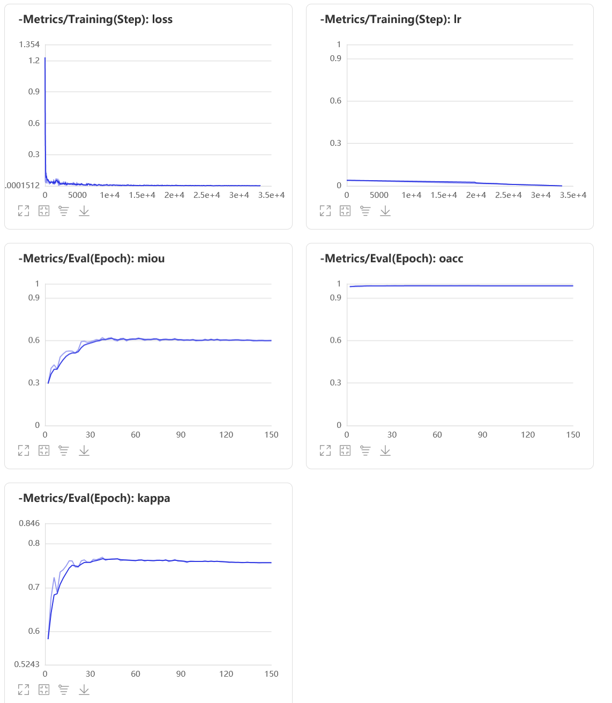
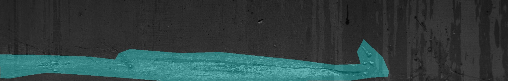
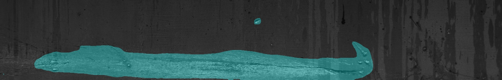
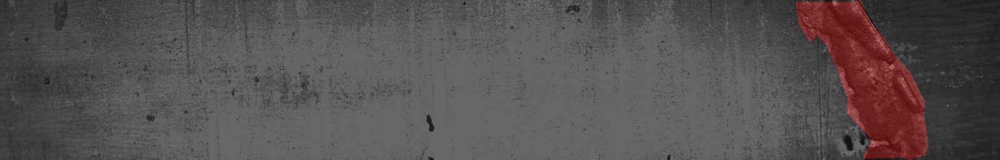

# 基于HRNet的模型优化
在项目中，我们采用HRNET作为钢板缺陷分割的模型。具体代码请参考[train.py](./train.py)。

运行如下代码开始训练模型(单机单卡)：

``` shell
export CUDA_VISIBLE_DEVICES=0
python train.py
```

若需使用多张GPU卡进行训练，例如使用4张卡时执行：
``` shell
python -m paddle.distributed.launch --gpus 0,1,2,3 train.py
```

在模型训练过程，在train函数中，将use_vdl设为True，则训练过程会自动将训练日志以VisualDL的格式打点在save_dir（用户自己指定的路径）下的vdl_log目录，用户可以使用如下命令启动VisualDL服务，查看可视化指标:
``` shell
visualdl --logdir output/hrnet/vdl_log --port 8001
```
服务启动后，使用浏览器打开 https://0.0.0.0:8001 或 https://localhost:8001。

在运行时如果显存不足，可以修改训练文件中的train_batch_size参数即可。

训练结果如下：

<div align="center">
  
</div>

可以看到miou值随着训练时间不断上升，在epoch=40左右基本已经收敛到最大值。最佳miou如下所示：
| arch | resolution | miou   |
| ---- | ---------- | -----  |
| HRNET| 800x128   | 62.75  |

### 4.2 模型预测

运行如下代码：
``` bash
python infer.py
```
则可生成可视化的分割结果。

预测结果如下：
<div align="center">
真值图1
  
预测图1
  
真值图2
  
预测图2
  
 </div>

从整体效果来看预测区域相对比较准确。

### 4.3 验证模型推理速度
使用calc_fps.py脚本可计算预测速度：
``` bash
python calc_fps.py
```
使用HRNET网络推理速度如下：
| arch | resolution | FPS   |
| ---- | ---------- | ----- |
| HRNET| 800x128   | 7.52  |

### 4.4 模型优化

前面我们实现了一个基准模型，本小节介绍一些通用的优化策略，可以在基准值基础上将精度再提升一些。

#### 4.4.1 分类损失函数
我们观察样本与标签可知，钢板的缺陷类型是极不均衡的，其中类别缺陷2占比很低，同时还有将近一半的钢板是没有缺陷的，这种样本分布不均衡的现象也是影响模型精度的一个重要原因。我们可以通过选择不同的损失函数或者组合不同的损失函数来优化这个问题，提升模型精度。在paddlex中，已经为用户提供了这个接口，在创建模型时，将[train.py](/train.py)文件中的代码:
```
model = pdx.seg.HRNet(num_classes=num_classes, width=48)
```
替换为：
```
model = pdx.seg.HRNet(num_classes=num_classes, width=48, use_mixed_loss=[('CrossEntropyLoss',0.7),('DiceLoss',0.3)])
```
这里我们采用混合损失函数CrossEntropyLoss+DiceLos来优化这个问题，这两个损失函数权重占比分别为0.7和0.3。详细接口使用介绍可以参考[官网](https://github.com/PaddlePaddle/PaddleX/blob/release/2.0.0/docs/apis/models/semantic_segmentation.md)。

采用混合损失函数后对比结果如下：
| arch  | epoch | resolution |  batch size | learning rate | Loss |  miou |
| -- | -- | -- | -- | -- | -- | -- |
|  HRNET | 150 | 800x128 | 16 | 0.01 | CrossEntropyLoss | 62.75%
| HRNET  | 150 | 800x128 | 16 | 0.01 | CrossEntropyLoss+DiceLoss | 64.46%

可以看到，使用混合损失函数模型有1.71%的提升。

#### 4.4.2 数据增强

从前面的数据分析看到，除了缺陷3以外，其它缺陷类型样本数都不多，我们的算法模型无法从这些少量的样本数据中充分学到准确的图像特征，因此，我们可以加入一些数据增强策略来进一步提升模型的精度。前面的[train](/train.py)代码里面只选用了简单的[RandomHorizontalFlip](https://paddlex.readthedocs.io/zh_CN/develop/apis/transforms/det_transforms.html#randomhorizontalflip)数据增强方法，下面我们使用更多的数据增强算子来进一步提升性能。

将代码：
```
train_transforms = T.Compose([
    T.Resize(target_size=[128,800], interp='LINEAR', keep_ratio=False),
    T.RandomHorizontalFlip(),
    T.Normalize(
        mean=[0.5, 0.5, 0.5], std=[0.5, 0.5, 0.5]),
])
```
替换为：
```
train_transforms = T.Compose([
    T.Resize(target_size=[128,800], interp='LINEAR', keep_ratio=False),
    T.RandomHorizontalFlip(),
    T.RandomDistort(brightness_range=0.5, brightness_prob=0.5, contrast_range=0.5, contrast_prob=0.5, saturation_range=0.5, saturation_prob=0.5),
    T.Normalize(
        mean=[0.5, 0.5, 0.5], std=[0.5, 0.5, 0.5]),
])
```

重新训练结果如下：

| arch  | epoch | resolution |  batch size | learning rate | Loss| Argument |  miou |
| -- | -- | -- | -- | -- | -- | -- | -- |
|  HRNET | 150 | 800x128 | 16 | 0.01 | CrossEntropyLoss|RandomHorizontalFlip | 62.75%
| HRNET  | 150 | 800x128 | 16 | 0.01 | CrossEntropyLoss+DiceLoss|RandomHorizontalFlip | 64.46%
| HRNET  | 150 | 800x128 | 16 | 0.01 | CrossEntropyLoss+DiceLoss|RandomCrop+RandomHorizontalFlip+RandomDistort+RandomBlur | 66.35%

可以看到，通过添加数据增强又上升了1.89%。
