# 钢材缺陷检测项目案例


## 一、项目简介
作为生产制造过程中必不可少的一步，物体表面缺陷检测广泛应用于工业领域，如：3C、半导体、电子、汽车、化工、医药、轻工、军工等行业。而钢材作为基础的工业材料，在出厂之前的检测更加严格。

针对上述场景，PaddleX提供可视化、自动化的AI质检方案，帮助企业提升生产效率，实现智能质检。


<div align="center">
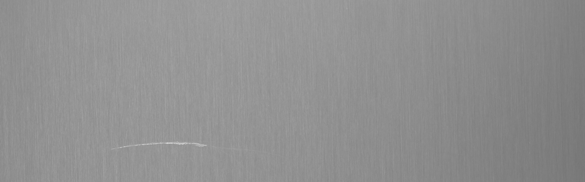  
</div>

## 二、 数据集分析

本项目来源于Kaggle上一个[钢材表面缺陷检测竞赛](https://www.kaggle.com/c/severstal-steel-defect-detection/overview)，这也是一个非常好的将深度学习应用于传统工业材料检测的案例。

这个竞赛主要目的是定位和分类钢板表面缺陷，属于语义分割问题。对应的数据集可以从[Kaggle竞赛官网](https://www.kaggle.com/c/severstal-steel-defect-detection/data)下载，下载下来后包含两个图像文件夹和两个标注文件：
<div align="center">
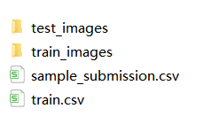  
</div>

分别对应如下：
* **train_images**：该文件夹中存储训练图像
* **test_images**：该文件夹中存储测试图像
* **train.csv**：该文件中存储训练图像的缺陷标注，有4类缺陷，ClassId = [1, 2, 3, 4]
* **sample_submission.csv**：该文件是一个上传文件的样例，每个ImageID要有4行，每一行对应一类缺陷

拿到数据后我们首先要做的就是先对数据集进行分析。下面我们按照文本和图像逐步来分析这个数据集。

### 2.1 读取和分析文本数据
假设下载下来的数据集放在名为severstal的文件夹中，首先读取csv文本数据
``` python
import pandas as pd
from collections import defaultdict

train_df = pd.read_csv("severstal/train.csv")
sample_df = pd.read_csv("severstal/sample_submission.csv")
```
初步查看下里面的数据
``` python
print(train_df.head())
print('\r\n')
print(sample_df.head())
```
结果如下：
``` shell
   ImageId_ClassId                                      EncodedPixels
0  0002cc93b.jpg_1  29102 12 29346 24 29602 24 29858 24 30114 24 3...
1  0002cc93b.jpg_2                                                NaN
2  0002cc93b.jpg_3                                                NaN
3  0002cc93b.jpg_4                                                NaN
4  00031f466.jpg_1                                                NaN

   ImageId_ClassId EncodedPixels
0  004f40c73.jpg_1           1 1
1  004f40c73.jpg_2           1 1
2  004f40c73.jpg_3           1 1
3  004f40c73.jpg_4           1 1
4  006f39c41.jpg_1           1 1
```

注意数据的标注形式，一共2列：第1列：ImageId_ClassId（图片编号+类编号）；第2例EncodedPixels（图像标签）。注意这个图像标签和我们平常遇到的不一样，平常的是一个mask灰度图像，里面有许多数字填充，背景为0，但是这里，为了缩小数据，它使用的是像素“列位置-长度”格式。举个例子：

我们把一个图像（h,w）flatten（**注意不是按行而是按列**），29102 12 29346 24 29602 24表示从29102像素位置开始的12长度均为非背景，后面以此类推。这就相当于在每个图像上画一条竖线。

接下来统计有无缺陷及每类缺陷的图像数量：
``` python
class_dict = defaultdict(int)
kind_class_dict = defaultdict(int)
no_defects_num = 0
defects_num = 0

for col in range(0, len(train_df), 4):
    img_names = [str(i).split("_")[0] for i in train_df.iloc[col:col+4, 0].values]
    if not (img_names[0] == img_names[1] == img_names[2] == img_names[3]):
        raise ValueError

    labels = train_df.iloc[col:col+4, 1]
    if labels.isna().all():
        no_defects_num += 1
    else:
        defects_num += 1

    kind_class_dict[sum(labels.isna().values == False)] += 1

    for idx, label in enumerate(labels.isna().values.tolist()):
        if label == False:
            class_dict[idx+1] += 1
```
输出有、无缺陷的图像数量
``` python
print("无缺陷钢板数量: {}".format(no_defects_num))
print("有缺陷钢板数量: {}".format(defects_num))
```
输出结果为：
``` shell
无缺陷钢板数量: 5902
有缺陷钢板数量: 6666
```
接下来对有缺陷的图像进行分类统计：
``` python
import seaborn as sns
import matplotlib.pyplot as plt

fig, ax = plt.subplots()
sns.barplot(x=list(class_dict.keys()), y=list(class_dict.values()), ax=ax)
ax.set_title("the number of images for each class")
ax.set_xlabel("class")
plt.show()
print(class_dict)
```
输出结果如下：
<div align="center">
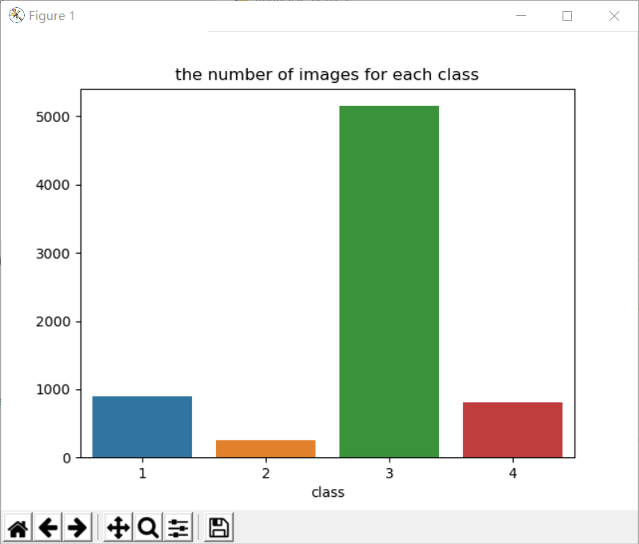  
</div>

``` shell
defaultdict(<class 'int'>, {1: 897, 3: 5150, 4: 801, 2: 247})
```
到这里得出的结论有两个：

（1）有缺陷和无缺陷的图像数量大致相当；

（2）缺陷的类别是不平衡的。

接下来统计一张图像中可能包含的缺陷种类数：
``` python
fig, ax = plt.subplots()
sns.barplot(x=list(kind_class_dict.keys()), y=list(kind_class_dict.values()), ax=ax)
ax.set_title("Number of classes included in each image");
ax.set_xlabel("number of classes in the image")
plt.show()
print(kind_class_dict)
```
输出结果如下：
<div align="center">
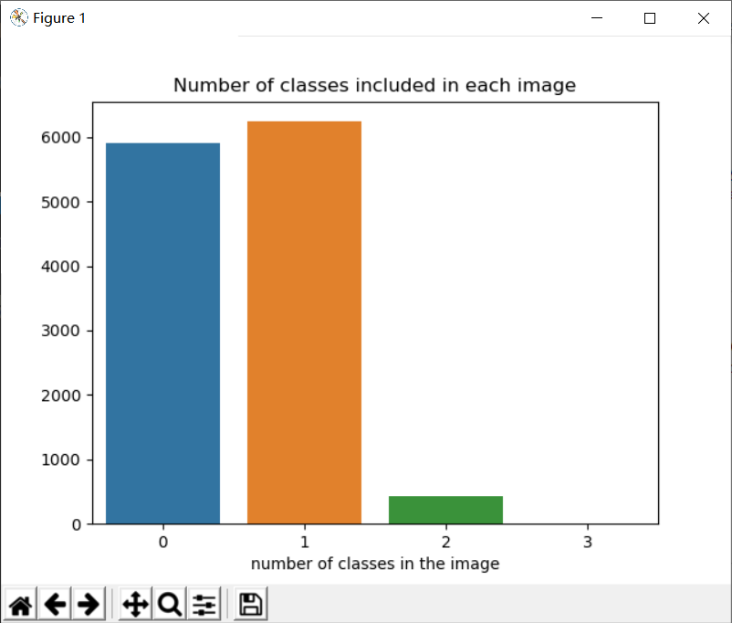  
</div>

``` shell
defaultdict(<class 'int'>, {1: 6239, 0: 5902, 2: 425, 3: 2})
```

这一步得到的结论是：
大多数图像没有缺陷或仅含一种缺陷，并且在训练集中没有1张图像会同时包含4中缺陷。

### 2.2 读取和分析图像数据
读取训练集图像数据
``` python
from collections import defaultdict
from pathlib import Path
from PIL import Image

train_size_dict = defaultdict(int)
train_path = Path("severstal/train_images/")
for img_name in train_path.iterdir():
    img = Image.open(img_name)
    train_size_dict[img.size] += 1
```
上面的代码一方面是检查训练集所有图像的尺寸是否一致，同时也检查每张图像格式是否正常，是否可以正常打开。

检查下训练集中图像的尺寸和数目
``` python
print(train_size_dict)
```
输出结果：
``` shell
defaultdict(<class 'int'>, {(1600, 256): 12568})
```

可以看到训练集中图像大小为1600乘以256大小，一共有12568张。所有图像尺寸是一样的。

接下来读取测试集图像数据：
``` python
test_size_dict = defaultdict(int)
test_path = Path("severstal/test_images/")

for img_name in test_path.iterdir():
    img = Image.open(img_name)
    test_size_dict[img.size] += 1

print(test_size_dict)
```

输出结果：
``` shell
defaultdict(<class 'int'>, {(1600, 256): 1801})
```

测试集中的图像也是1600乘以256，共1801张。

### 2.3 可视化数据集
首先读取csv文本数据
``` python
import numpy as np
import pandas as pd
import matplotlib.pyplot as plt
from pathlib import Path
import cv2

train_df = pd.read_csv("severstal/train.csv")
```

下面为了方便可视化，我们为不同的缺陷类别设置颜色显示：
``` python
palet = [(249, 192, 12), (0, 185, 241), (114, 0, 218), (249,50,12)]
fig, ax = plt.subplots(1, 4, figsize=(15, 5))
for i in range(4):
    ax[i].axis('off')
    ax[i].imshow(np.ones((50, 50, 3), dtype=np.uint8) * palet[i])
    ax[i].set_title("class color: {}".format(i+1))

fig.suptitle("each class colors")
plt.show()
```

输出如下：
<div align="center">
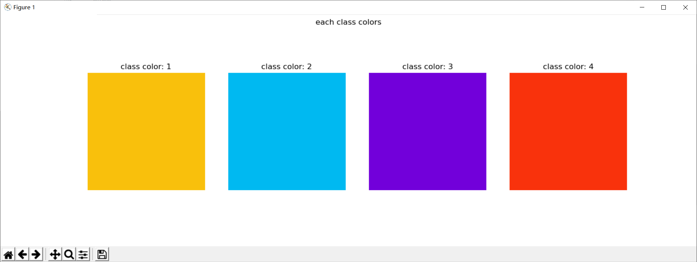  
</div>

接下来将不同的缺陷标识归类：
``` python
idx_no_defect = []
idx_class_1 = []
idx_class_2 = []
idx_class_3 = []
idx_class_4 = []
idx_class_multi = []
idx_class_triple = []

for col in range(0, len(train_df), 4):
    img_names = [str(i).split("_")[0] for i in train_df.iloc[col:col+4, 0].values]
    if not (img_names[0] == img_names[1] == img_names[2] == img_names[3]):
        raise ValueError

    labels = train_df.iloc[col:col+4, 1]
    if labels.isna().all():
        idx_no_defect.append(col)
    elif (labels.isna() == [False, True, True, True]).all():
        idx_class_1.append(col)
    elif (labels.isna() == [True, False, True, True]).all():
        idx_class_2.append(col)
    elif (labels.isna() == [True, True, False, True]).all():
        idx_class_3.append(col)
    elif (labels.isna() == [True, True, True, False]).all():
        idx_class_4.append(col)
    elif labels.isna().sum() == 1:
        idx_class_triple.append(col)
    else:
        idx_class_multi.append(col)

train_path = Path("severstal/train_images/")
```

接下来创建可视化标注函数：
``` python
def name_and_mask(start_idx):
    col = start_idx
    img_names = [str(i).split("_")[0] for i in train_df.iloc[col:col+4, 0].values]
    if not (img_names[0] == img_names[1] == img_names[2] == img_names[3]):
        raise ValueError

    labels = train_df.iloc[col:col+4, 1]
    mask = np.zeros((256, 1600, 4), dtype=np.uint8)

    for idx, label in enumerate(labels.values):
        if label is not np.nan:
            mask_label = np.zeros(1600*256, dtype=np.uint8)
            label = label.split(" ")
            positions = map(int, label[0::2])
            length = map(int, label[1::2])
            for pos, le in zip(positions, length):
                mask_label[pos-1:pos+le-1] = 1
            mask[:, :, idx] = mask_label.reshape(256, 1600, order='F')  #按列取值reshape

    return img_names[0], mask

def show_mask_image(col):
    name, mask = name_and_mask(col)
    img = cv2.imread(str(train_path / name))
    fig, ax = plt.subplots(figsize=(15, 15))
    for ch in range(4):
        contours, _ = cv2.findContours(mask[:, :, ch], cv2.RETR_LIST, cv2.CHAIN_APPROX_NONE)
        for i in range(0, len(contours)):
            cv2.polylines(img, contours[i], True, palet[ch], 2)

    ax.set_title(name)
    ax.imshow(img)
    plt.show()
```

接下来先展示5张无缺陷图像：
``` python
for idx in idx_no_defect[:5]:
    show_mask_image(idx)
```

输出结果如下：
<div align="center">
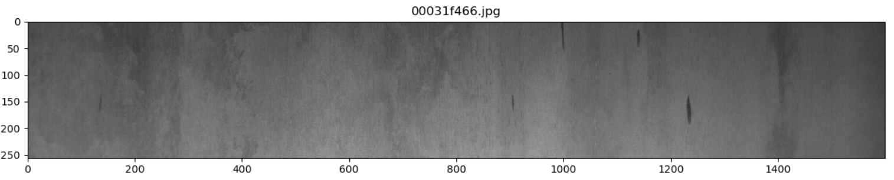  
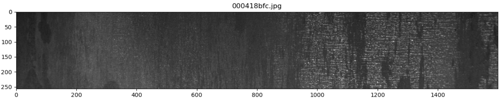  
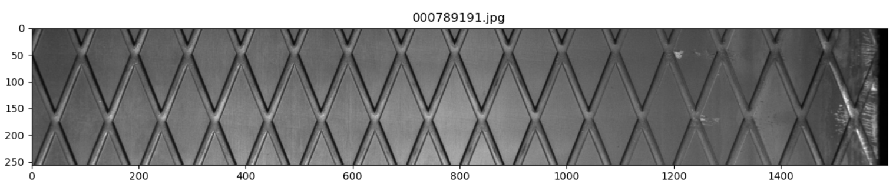  
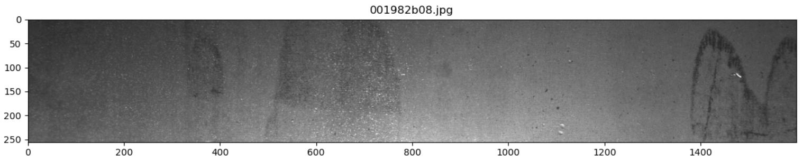  
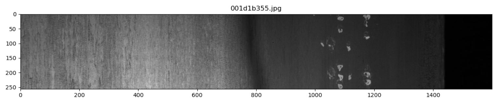  
</div>

仅含第1类缺陷的图像展示:
``` python
for idx in idx_class_1[:5]:
    show_mask_image(idx)
```

输出结果如下：
<div align="center">
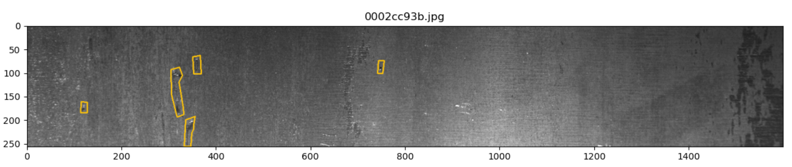  
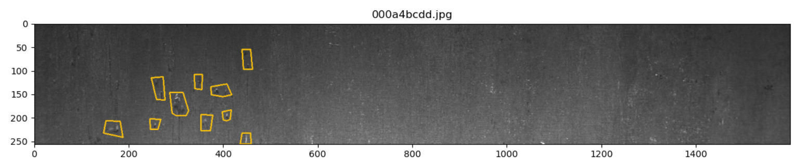  
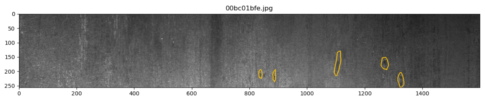  
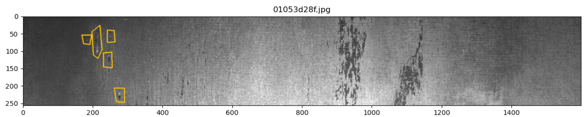  
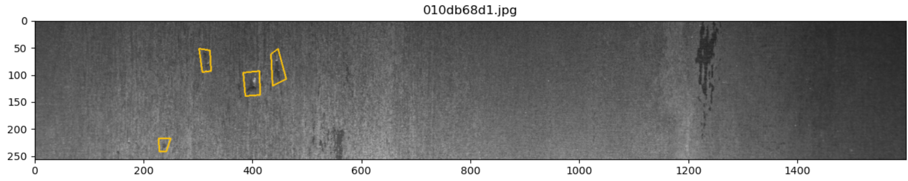  
</div>

从图像上分析第1类缺陷主要是局部的白色噪点和黑色噪点混合区。

仅含第2类缺陷的图像展示：
``` python
for idx in idx_class_2[:5]:
    show_mask_image(idx)
```

输出结果如下：
<div align="center">
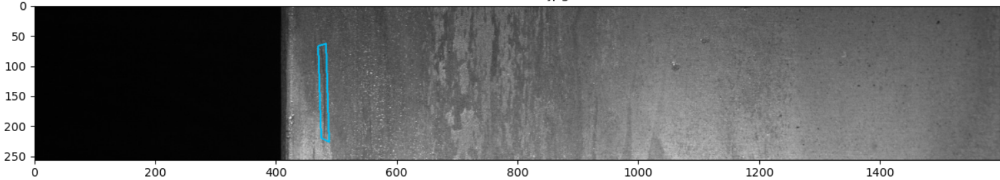  
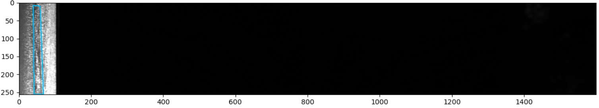  
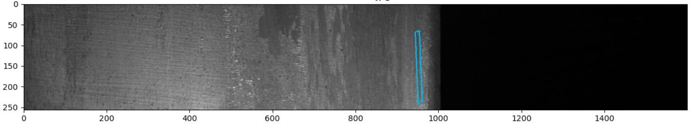  
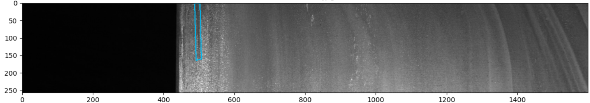  
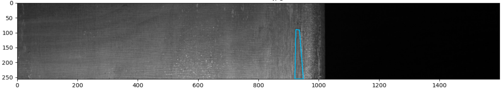  
</div>

从图像上分析第2类缺陷主要是竖状黑色划痕类

仅含第3类缺陷的图像展示：
``` python
for idx in idx_class_3[:5]:
    show_mask_image(idx)
```

输出结果如下：
<div align="center">
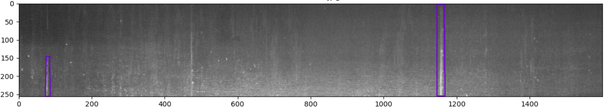  
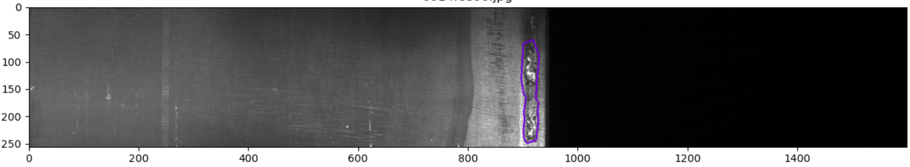  
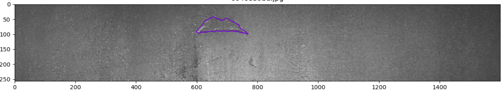  
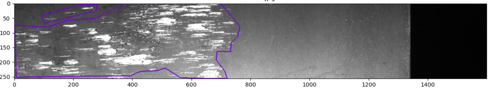  
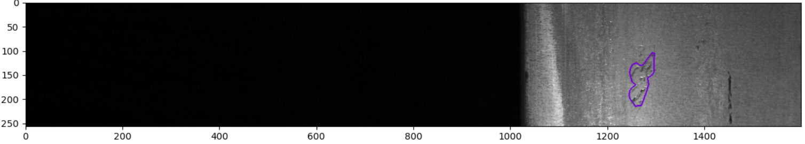  
</div>

从图像上分析第3类缺陷类型比较多样，这也可以从前面分析得到的第3类缺陷占比看出。总结来看，第3类缺陷主要是白色噪点和白色划痕的成片区域。

仅含第4类缺陷的图像展示：
``` python
for idx in idx_class_4[:5]:
    show_mask_image(idx)
```

输出结果如下：
<div align="center">
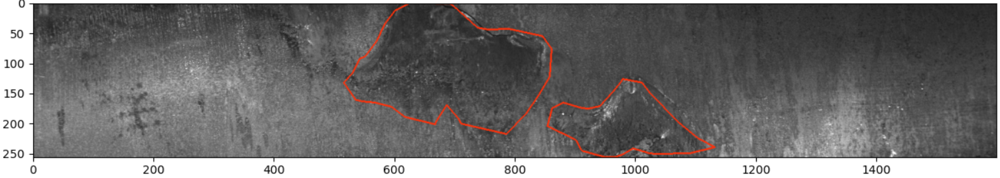  
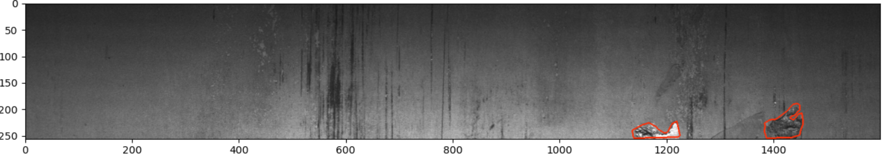  
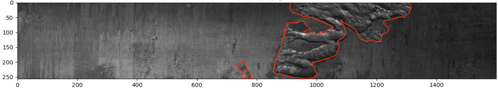  
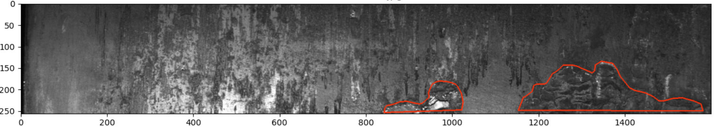  
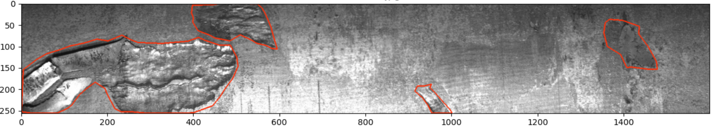  
</div>

从图像上分析第4类缺陷主要是大面积的黑色凸起。

最后再看下同时具有3种缺陷的图片：
``` python
for idx in idx_class_triple:
    show_mask_image(idx)
```
<div align="center">
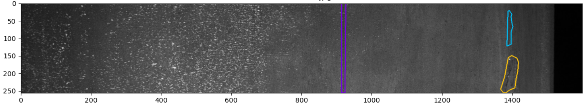  
</div>

以上分析可以帮助我们快速掌握数据基本属性，初步了解项目难度。在实际比赛时这些数据分析是非常重要的，通过这些数据分析再挖掘整理成重要的“线索”，然后改进算法模型，往往可以取得出其不意的好效果。

## 三、制作标准数据集

### 3.1 PaddleX数据集格式说明
从前面的数据分析中我们看到钢板图像的每个像素只属于1种缺陷类别（或者没缺陷），由于需要定位出钢板缺陷的精细区域，因此可以把这个任务看作是一个语义分割任务，即按照像素级别精度判断每个像素所属的缺陷类别。


为了能够使用PaddleX进行语义分割训练，我们首先要对数据集格式进行转化。PaddleX语义分割算法[要求](https://github.com/PaddlePaddle/PaddleX/blob/release/2.0.0/docs/data/format/segmentation.md)数据集按照如下方式进行组织：

原图均放在同一目录，如`JPEGImages`，标注的同名png文件均放在同一目录，如`Annotations`。示例如下：
```
MyDataset/ # 语义分割数据集根目录
|--JPEGImages/ # 原图文件所在目录
|  |--1.jpg
|  |--2.jpg
|  |--...
|  |--...
|
|--Annotations/ # 标注文件所在目录
|  |--1.png
|  |--2.png
|  |--...
|  |--...
```

JPEGImages目录存放的是原文件图像(jpg格式)，Annotations存放对应的标注文件图像(png格式) 。这里的标注图像，如1.png，为单通道图像,像素标注类别需要从0开始递增, 例如0， 1， 2， 3表示4种类别（一般0表示background背景)，标注类别最多255个类别(其中像素值255不参与训练和评估)。

### 3.2 数据转换
数据转换本身并不难，在前面可视化数据的时候已经将缺陷区域显示了出来，因此，数据转化时只需要将缺陷对应的灰度值填入mask即可。

将下载下来的[数据集](https://www.kaggle.com/c/severstal-steel-defect-detection/data)解压后放置在当前项目根目录下，然后执行下面的代码即可：
``` shell
python prepare_dataset.py
```

执行完后在当前根目录下会生成PaddleX标准的数据集，名为steel。

执行完以后在生成的steel文件夹下面创建一个标签说明文件，文件名为labels.txt,内容如下：
``` shell
0
1
2
3
4
```
这个文件用来指明当前到底有哪些像素标签值（本项目共4种缺陷，对应标签为1、2、3、4，这里的0标签表示背景）


### 3.3 数据切分
在模型进行训练时，我们需要划分训练集，验证集和测试集，可直接使用paddlex命令将数据集随机划分。本项目将训练集、验证集和测试集按照8.5：1：0.5的比例划分。 PaddleX中提供了简单易用的API，方便用户直接使用进行数据划分。具体命令如下：
``` shell
paddlex --split_dataset --format SEG --dataset_dir steel --val_value 0.1 --test_val 0.05
```

数据文件夹切分前后的状态如下:

```bash
  steel/                            steel/
  ├── Annotations/      -->         ├── Annotations/
  ├── JPEGImages/                   ├── JPEGImages/
  ├── labels.txt                    ├── labels.txt
                                    ├── test_list.txt
                                    ├── train_list.txt
                                    ├── val_list.txt
  ```
执行上面命令行，会在steel下生成train_list.txt, val_list.txt, test_list.txt，分别存储训练样本列表，验证样本列表，测试样本列表。

## 四、训练和验证
PaddleX提供了丰富的视觉模型，在语义分割中提供了DeepLabV3、UNET、HRNET和FastSCNN系列模型。在本项目中采用重量级HRNET为分割模型进行钢板缺陷检测。
#### 4.1 [基于HRNet模型](./HRNet.md)
#### 4.2 [基于UNet模型](./UNet.md)

## 五、部署
### 5.1 模型导出
模型训练后保存在output文件夹，如果要使用PaddleInference进行部署需要导出成静态图的模型,运行如下命令，会自动在output文件夹下创建一个`inference_model`的文件夹，用来存放导出后的模型。
``` bash
paddlex --export_inference --model_dir=output/hrnet/best_model --save_dir=output/inference_model
```

### 5.2 C#桌面部署
模型部署采用了PaddleX提供的C++ inference部署方案，在该方案中提供了C#部署[Demo](https://github.com/PaddlePaddle/PaddleX/tree/develop/examples/C%23_deploy)，用户可根据实际情况自行参考修改。

<div align="center">
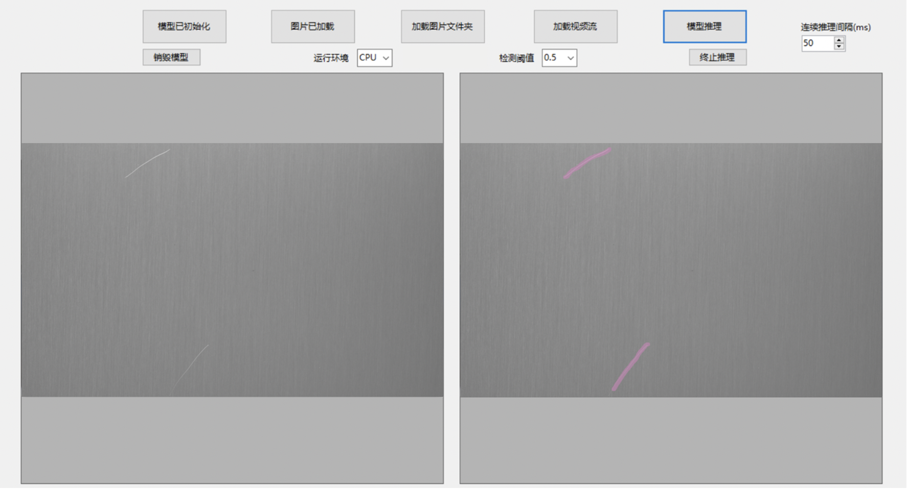  
</div>

* 感谢[佟兴宇](https://github.com/txyugood)、[钱彬](https://github.com/qianbin1989228)两位同学对于本案例的贡献。
* 示例图片引用说明：本项目中示例数据源于Kaggle[钢材表面缺陷检测竞赛](https://www.kaggle.com/c/severstal-steel-defect-detection/overview) 