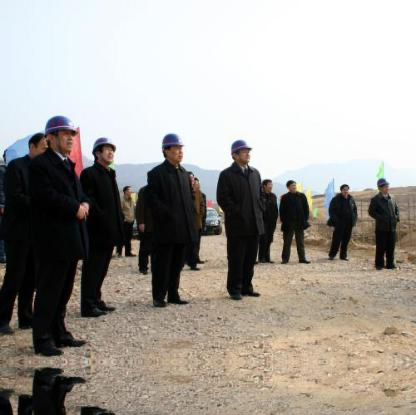
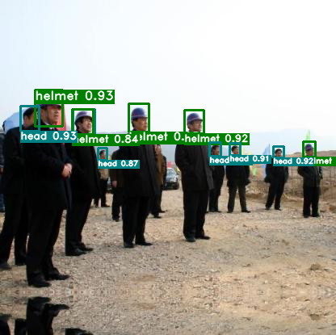
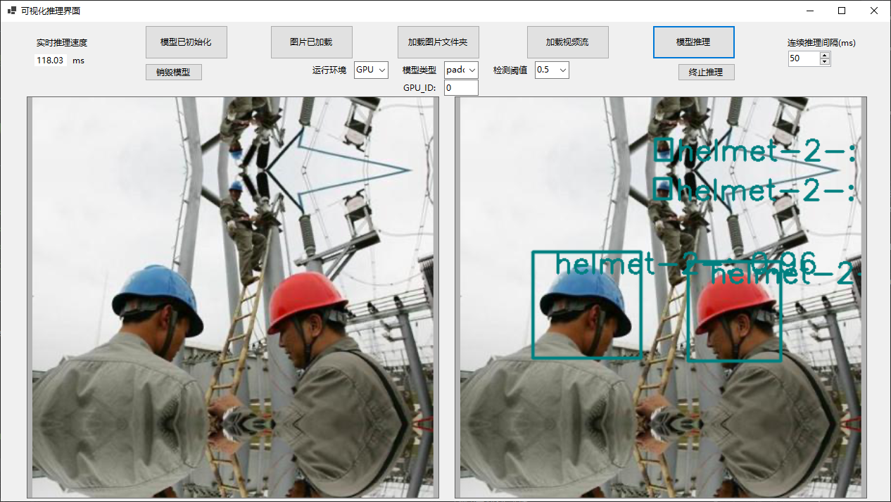

# 安全帽检测

> 基于Paddlex2.0API开发

## 1.项目说明

在该项目中，主要向大家介绍如何使用目标检测来实现对安全帽的检测，涉及代码以及优化过程亦可用于其它目标检测任务等。

在施工现场，对于来往人员，以及工作人员而言，安全问题至关重要。而安全帽更是保障施工现场在场人员安全的第一防线，因此需要对场地中的人员进行安全提醒。当人员未佩戴安全帽进入施工场所时，人为监管耗时耗力，而且不易实时监管，过程繁琐、消耗人力且实时性较差。针对上述问题，希望通过**视频监控->目标检测->智能督导**的方式智能、高效的完成此任务:

<div align="center">

</div>


**业务难点：**

- **精度要求高** 由于涉及安全问题，需要精度非常高才能保证对施工场所人员的安全督导。需要专门针对此目标的检测算法进行优化，另外，还需要处理拍摄角度、光线不完全受控，安全帽显示不全、可能存在遮挡等情况。
- **小目标检测** 由于实际使用过程中，人员里镜头较远，因此需要模型对小目标的检测有较低的漏检率。

<div align="center">
</div>


## 2.数据准备

数据集中包含了5000张已经标注好的数据。该项目采用目标检测的标注方式，在本文档中提供了VOC数据集格式。[点击此处前往下载数据集](https://aistudio.baidu.com/aistudio/datasetdetail/50329)

**下载后的数据集文件夹需要更改一下命名:**

```
dataset/                          dataset/
  ├── annotations/      -->         ├── Annotations/
  ├── images/                       ├── JPEGImages/
```

数据集分类情况: **`head` , `helmet`, `person`.**

更多数据格式信息请参考[数据标注说明文档](https://paddlex.readthedocs.io/zh_CN/develop/data/annotation/index.html)

- **数据切分** 将训练集和验证集按照8.5：1.5的比例划分。 PaddleX中提供了简单易用的API，方便用户直接使用进行数据划分。

```
paddlex --split_dataset --format VOC --dataset_dir dataset --val_value 0.15
```

```
dataset/                          dataset/
  ├── Annotations/      -->         ├── Annotations/
  ├── JPEGImages/                   ├── JPEGImages/
                                    ├── labels.txt
                                    ├── train_list.txt
                                    ├── val_list.txt
```


## 3.模型选择

PaddleX提供了丰富的视觉模型，在目标检测中提供了RCNN和YOLO系列模型。在本项目中采用YOLO作为检测模型进行安全帽检测。

## 4. 模型训练


在本项目中，采用YOLOV3作为安全帽检测的基线模型，以COCO指标作为评估指标。具体代码请参考[train.py](./code/train.py)

运行如下代码开始训练模型：

```
python code/train.py
```

若输入如下代码，则可在log文件中查看训练日志，log文件保存在`code`目标下

```
python code/train.py > log
```

- 训练过程说明

<div align="center">
</div>


## 5.模型优化(进阶)

- 精度提升 为了进一步提升模型的精度，可以通过**coco_error_analysis**，具体请参考[模型优化分析文档](./accuracy_improvement.md)


采用PaddleX在Tesla V100上测试模型的推理时间（输入数据拷贝至GPU的时间、计算时间、数据拷贝至CPU的时间），推理时间如下表所示：（十次推理取平均耗时）

| 模型                                                         | 推理时间 （ms/image） | map(Iou-0.5) | (coco)mmap | 安全帽AP(Iou-0.5) |
| ------------------------------------------------------------ | :-------------------: | ------------ | :--------: | :---------------: |
| baseline: YOLOv3 + DarkNet53 + cluster_yolo_anchor + img_size(480) |         50.34         | 61.6         |    39.2    |       94.58       |
| YOLOv3 + ResNet50_vd_dcn + cluster_yolo_anchor+img_size(480) |         53.81         | 61.7         |    39.1    |       95.35       |
| **PPYOLO + ResNet50_vd_dcn + iou_aware + img_size(480)**     |         72.88         | **62.4**     |    37.7    |     **95.73**     |
| PPYOLO + ResNet50_vd_dcn + cluster_yolo_anchor + img_size(480) |         67.14         | 61.8         |    39.8    |       95.08       |
| **PPYOLOV2 + ResNet50_vd_dcn + img_size(608)**               |         81.52         | 61.6         |  **41.3**  |       95.32       |
| PPYOLOV2 + ResNet101_vd_dcn + img_size(608)                  |        106.62         | 61.3         |    40.6    |       95.15       |
|                                                              |                       |              |            |                   |

注意:

- **608**的图像大小，一般使用默认的anchors进行训练和推理即可。
- **cluster_yolo_anchor**: 用于生成拟合数据集的模型anchor

```
anchors = train_dataset.cluster_yolo_anchor(num_anchors=9, image_size=480)
anchor_masks = [[6, 7, 8], [3, 4, 5], [0, 1, 2]]
```


**优化进展说明**：

- 1.通过选择**更好的backbone**作为特征提取的骨干网络可以提高识别率、降低漏检率。<**DarkNet53 到 ResNet50_vd_dcn**>

- 2.通过选择更好的检测架构可以提高检测的mmap值——即**Neck，Head部分的优化**可以提高ap。<**YOLOV3 到 PPYOLOV2**>

- 3.缩放适当的图像大小可以提高模型的识别率，但是存在一定的阈值——当图像大小到某一个阈值时会导致精度下降。

  - **一般图像大小选择(YOLO系列)**:320，480， 608。
  - 一般**图像如果较大，物体也比较大**，可以较为放心的缩小图像大小再进行相关的训练和预测。
  - 物体较小，不易缩小，**可以适当的裁剪划分原图或放大**，并处理对应的标注数据，再进行训练。

  <**480到608**>

- 4.通过cluster_yolo_anchor生成当前网络输入图像大小下拟合数据集的预置anchors，利用新生成的anchors替换原来的默认anchor，使得模型预测定位上框选**位置更准确**。

- 5.通过PPYOLO两个实验，一个使用**iou_aware**，一个不是使用**iou_aware**而采用聚类得到的**anchor**提高定位能力；分析数据发现在定位信息优化上，**iou_aware**在当前数据集上表现更好，但推理时间也有所提升。

- 通过以上的简单优化方式，获取了两个较好的模型结果:

- | 模型                                           | 推理时间 （ms/image） | map(Iou-0.5) | (coco)mmap | 安全帽AP(Iou-0.5) |
  | ---------------------------------------------- | :-------------------: | ------------ | :--------: | :---------------: |
  | **PPYOLO + ResNet50_vd_dcn + img_size(480)**   |         72.88         | **62.4**     |    37.7    |     **95.73**     |
  | **PPYOLOV2 + ResNet50_vd_dcn + img_size(608)** |         81.52         | 61.6         |  **41.3**  |       95.32       |

## 6.模型预测


运行如下代码：

```
python code/infer.py
```

则可生成result.txt文件并显示预测结果图片，result.txt文件中会显示图片中每个检测框的位置、类别及置信度, 从而实现了安全帽的自动检测。

预测结果如下：

<div align="center">

</div>


## 7.模型导出

模型训练后保存在output文件夹，如果要使用PaddleInference进行部署需要导出成静态图的模型,运行如下命令，会自动在output文件夹下创建一个`inference_model`的文件夹，用来存放导出后的模型。

```
paddlex --export_inference --model_dir=output/yolov3_darknet53/best_model --save_dir=output/inference_model --fixed_input_shape=[480,480]
```

**注意**：设定 fixed_input_shape 的数值需与 eval_transforms 中设置的 target_size 数值上保持一致。

## 8.模型上线选择

本案例面向GPU端的最终方案是选择一阶段检测模型PPYOLOV2，其骨干网络选择加入了可变形卷积（DCN）的ResNet50_vd，训练阶段数据增强策略采用RandomHorizontalFlip、RandomDistort、RandomCrop等。

在Tesla V100的Linux系统下，模型的推理时间大约为81.52ms/image，包括transform、输入数据拷贝至GPU的时间、计算时间、数据拷贝至CPU的时间。

| 模型                                       | 推理时间 (ms/image) | map(Iou-0.5) | (coco)mmap | 安全帽AP(Iou-0.5) |
| ------------------------------------------ | ------------------- | ------------ | :--------: | :---------------: |
| PPYOLOV2 + ResNet50_vd_dcn + img_size(608) | 81.52               | 61.6         |    41.3    |       95.32       |
|                                            |                     |              |            |                   |

**上线模型的PR曲线:**

<div align="center">
</div>


在本项目中的安全帽检测数据中，标注信息本身存在一定的缺漏，导致部分类别学习失效。但针对本项目的安全帽检测问题而言，**person(人)这一类别影响不大，因此可以在mmap较大的基础上主要看helmet(安全帽)的精度即可**。通过**COCO的评估指标**，可以使多类别的检测模型的评估更加符合实际应用；虽然我们可以看出在该数据集中，有一个类别对整体的map与mmap有较大影响，但是通过COCO指标能够取得一个相对数据集更**综合表现**(不同Iou尺度下)的一个模型。

**注意**: 通过VOC指标也许能够取得更好的Iou-0.5指标下更好的数据，但是却会使得对多Iou尺度的一个评估，使得得到该评估指标下最好的模型未必在其它Iou尺度下也有最好的表现。

## 9.模型部署方式


模型部署采用了PaddleX提供的C++ inference部署方案，在该方案中提供了C#部署[Demo](../../C%23_deploy)，用户可根据实际情况自行参考。

<div align="center">
</div>


