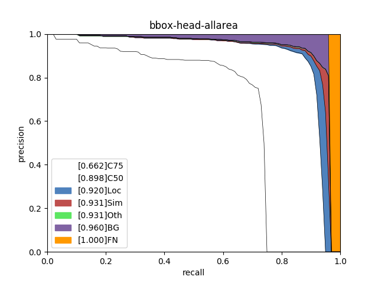
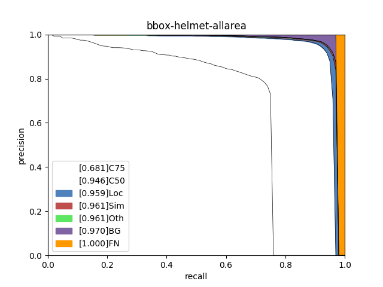

# 精度优化思路分析

本小节侧重展示在模型迭代过程中优化精度的思路，在本案例中，有些优化策略获得了精度收益，而有些没有。在其他场景中，可根据实际情况尝试这些优化策略。

## (1) 基线模型选择

相较于二阶段检测模型，单阶段检测模型的精度略低但是速度更快。考虑到是部署到GPU端，本案例选择单阶段检测模型YOLOV3作为基线模型，其骨干网络选择DarNet53。训练完成后，模型在验证集上的精度如下:

| 模型                                                         | 推理时间 （ms/image） | map(Iou-0.5) | (coco)mmap | 安全帽AP(Iou-0.5) |
| ------------------------------------------------------------ | :-------------------: | ------------ | :--------: | :---------------: |
| baseline: YOLOv3 + DarkNet53 + cluster_yolo_anchor + img_size(480) |         50.34         | 61.6         |    39.2    |       94.58       |

## (2) 基线模型效果分析与优化

使用PaddleX提供的[paddlex.det.coco_error_analysis](https://paddlex.readthedocs.io/zh_CN/develop/apis/visualize.html#paddlex-det-coco-error-analysis)接口对模型在验证集上预测错误的原因进行分析，分析结果以图表的形式展示如下：

| allclass                                    | head                                         | person                                       | helmet                                       |
| ------------------------------------------- | -------------------------------------------- | -------------------------------------------- | -------------------------------------------- |
|  |  |  |  |

分析图表展示了7条Precision-Recall（PR）曲线，每一条曲线表示的Average Precision （AP）比它左边那条高，原因是逐步放宽了评估要求。以helmet类为例，各条PR曲线的评估要求解释如下：

- C75: 在IoU设置为0.75时的PR曲线, AP为0.681。
- C50: 在IoU设置为0.5时的PR曲线，AP为0.946。C50与C75之间的白色区域面积代表将IoU从0.75放宽至0.5带来的AP增益。
- Loc: 在IoU设置为0.1时的PR曲线，AP为0.959。Loc与C50之间的蓝色区域面积代表将IoU从0.5放宽至0.1带来的AP增益。蓝色区域面积越大，表示越多的检测框位置不够精准。
- Sim: 在Loc的基础上，如果检测框与真值框的类别不相同，但两者同属于一个亚类，则不认为该检测框是错误的，在这种评估要求下的PR曲线, AP为0.961。Sim与Loc之间的红色区域面积越大，表示子类间的混淆程度越高。VOC格式的数据集所有的类别都属于同一个亚类。
- Oth: 在Sim的基础上，如果检测框与真值框的亚类不相同，则不认为该检测框是错误的，在这种评估要求下的PR曲线，AP为0.961。Oth与Sim之间的绿色区域面积越大，表示亚类间的混淆程度越高。VOC格式的数据集中所有的类别都属于同一个亚类，故不存在亚类间的混淆。
- BG: 在Oth的基础上，背景区域上的检测框不认为是错误的，在这种评估要求下的PR曲线，AP为0.970。BG与Oth之间的紫色区域面积越大，表示背景区域被误检的数量越多。
- FN: 在BG的基础上，漏检的真值框不认为是错误的，在这种评估要求下的PR曲线，AP为1.00。FN与BG之间的橙色区域面积越大，表示漏检的真值框数量越多。

从分析图表中可以看出，head、helmet两类检测效果较好，但仍然存在漏检的情况，特别是person存在很大的漏检问题；此外，通过helmet中C75指标可以看出，其相对于C50的0.946而言有些差了，因此定位性能有待进一步提高。为进一步理解造成这些问题的原因，将验证集上的预测结果进行了可视化，然后发现数据集标注存在以下问题：

- 本数据集主要考虑到头部和安全帽的检测，因此在人检测时，有个图片中标注了，而有的图片中没有标注，从而导致学习失效，引发person漏检。
- head与helmet大多数情况标注较好，但由于部分拍摄角度导致有的图片中的head和helmet发生重叠以及太小导致学习有困难。

考虑到漏检问题，一般是特征学习不够，无法识别出物体，因此基于这个方向，尝试替换backbone: DarNet53 --> ResNet50_vd_dcn，在指标上的提升如下:

| 模型                                                         | 推理时间 （ms/image） | map(Iou-0.5) | (coco)mmap | 安全帽AP(Iou-0.5) |
| ------------------------------------------------------------ | :-------------------: | ------------ | :--------: | :---------------: |
| YOLOv3 + ResNet50_vd_dcn + cluster_yolo_anchor+img_size(480) |         53.81         | **61.7**     |    39.1    |     **95.35**     |

考虑到定位问题，通过尝试放大图片，不同的网络结构以及定位的优化策略: 利用`cluster_yolo_anchor`生成聚类的anchor或开启iou_aware。最终得到上线模型PPYOLOV2的精度如下:

| 模型                                           | 推理时间 （ms/image） | map(Iou-0.5) | (coco)mmap | 安全帽AP(Iou-0.5) |
| ---------------------------------------------- | :-------------------: | ------------ | :--------: | :---------------: |
| **PPYOLOV2 + ResNet50_vd_dcn + img_size(608)** |         81.52         | 61.6         |  **41.3**  |       95.32       |

其中helmet类误差分析如下图:

    

从分析表中可以看出:

- C75指标效果明显改善，定位更加准确：**从0.681提升到0.742**。
- 其中BG到FN的差距**从0.03降低到了0.02**，说明漏检情况有所改善。
- 其中Loc与Sim的差距**从0.002降低到了0.001**，说明混淆程度也下降了。
- 其中Oth与BG的差距**从0.019降低到了0.015**，说明检测错误下降了。

本项目优化整体分析可归纳为以下几点:

- 通过选用适当更优的骨干网络可以改善漏检的情况，因此漏检方面的优化可以考虑先从骨干网络替换上开始——当然必要的数据清洗也是不可缺少的，要是数据集本身漏标，则会从根本上影响模型的学习。
- 通过放大图像，可以对一些中小目标的物体检测起到一定的优化作用。
- 通过聚类anchor以及iou_aware等操作可以提高模型的定位能力，直接体现是在高IoU上也能有更好的表现。【因此，定位不准可以从模型的anchor以及模型的结构上入手进行优化】

# (3) 数据增强选择

|                       训练预处理1(a1)                        |                          验证预处理                          |
| :----------------------------------------------------------: | :----------------------------------------------------------: |
|                  MixupImage(mixup_epoch=-1)                  |           Resize(target_size=480, interp='CUBIC')            |
|                       RandomDistort()                        | Normalize(mean=[0.485, 0.456, 0.406], std=[0.229, 0.224, 0.225]) |
|   RandomExpand(im_padding_value=[123.675, 116.28, 103.53])   |                                                              |
|                         RandomCrop()                         |                                                              |
|                    RandomHorizontalFlip()                    |                                                              |
| BatchRandomResize(target_sizes=[320, 352, 384, 416, 448, 480, 512, 544, 576, 608],interp='RANDOM') |                                                              |
| Normalize(mean=[0.485, 0.456, 0.406], std=[0.229, 0.224, 0.225]) |                                                              |

在加入了[RandomHorizontalFlip](https://paddlex.readthedocs.io/zh_CN/develop/apis/transforms/det_transforms.html#randomhorizontalflip)、[RandomDistort](https://paddlex.readthedocs.io/zh_CN/develop/apis/transforms/det_transforms.html#randomdistort)、[RandomCrop](https://paddlex.readthedocs.io/zh_CN/develop/apis/transforms/det_transforms.html#randomcrop)、[RandomExpand](https://paddlex.readthedocs.io/zh_CN/develop/apis/transforms/det_transforms.html#randomexpand)、[BatchRandomResize](https://paddlex.readthedocs.io/zh_CN/develop/apis/transforms/det_transforms.html#batchrandomresize)、[MixupImage](https://paddlex.readthedocs.io/zh_CN/develop/apis/transforms/det_transforms.html#mixupimage)这几种数据增强方法后，对模型的优化是有一定的积极作用了，在取消这些预处理后，模型性能会有一定的下降。

**PS**：建议在训练初期都加上这些预处理方法，到后期模型超参数以及相关结构确定最优之后，再进行数据方面的再优化: 比如数据清洗，数据预处理方法筛选等。

>
