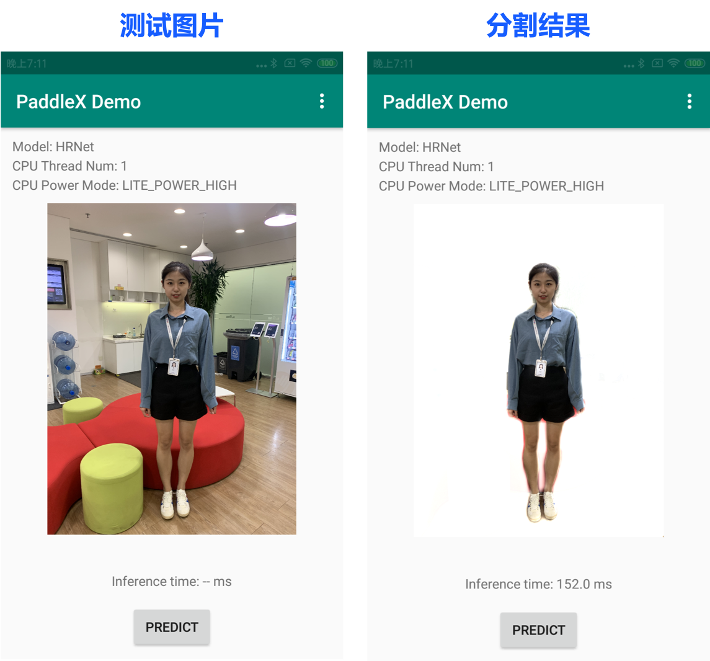

# HumanSeg portrait segmentation model.

This tutorial implements portrait segmentation based on the PaddleX core segmentation model, opens up pre-training models and test data, supports video streaming portrait segmentation, and provides guidance on the whole process of from model Fine-tune to Paddle Lite mobile-end deployment.

## Directory

* [Pre-training models and test data](#1)
* [Quick experience of video streaming portrait segmentation](#2)
* [Model Fine-tune](#3)
* [Paddle Lite mobile-end deployment](#4)


## <h2 id="1">Pre-training models and test data</h2>

#### Pre-training model

This case opens up two models trained on large-scale portrait datasets for both server-end and mobile-end scenarios. These models can be used to quickly experience video stream portrait segmentation, deployed to mobile for real-time portrait segmentation, or used to complete model fine-tuning.

| Model Types | Checkpoint Parameter | Inference Model | Quant Inference Model | Note |
| --- | --- | --- | ---| --- |
| HumanSeg-server | [humanseg_server_params](https://bj.bcebos.com/paddlex/examples/human_seg/models/humanseg_server_params.tar) | [humanseg_server_inference](https://bj.bcebos.com/paddlex/examples/human_seg/models/humanseg_server_inference.tar) | --- |High-precision model is suitable for server-end GPU and complex background portrait scenes. The model structure is Deeplabv3+/Xcetion65, and input size is (512, 512). |
| HumanSeg-mobile | [humanseg_mobile_params](https://bj.bcebos.com/paddlex/examples/human_seg/models/humanseg_mobile_params.tar) | [humanseg_mobile_inference](https://bj.bcebos.com/paddlex/examples/human_seg/models/humanseg_mobile_inference.tar) | [humanseg_mobile_quant](https://bj.bcebos.com/paddlex/examples/human_seg/models/humanseg_mobile_quant.tar) | Lightweight model is suitable for mobile-end or server-end CPU front camera scenarios. The model structure is HRNet_w18_small_v1, and input size is (192, 192). |

> * Checkpoint Parameter is a model weight for fine-tuning scenarios, containing `__params__` model parameter and `model.yaml`-based model configuration information.
> * Inference Model and Quant Inference Model are prediction deployment models, containing `__model__` computational graph structure, `__params__` model parameter, and `model.yaml`-based model configuration information.
> * The Inference Model is for server-end CPU and GPU prediction deployment. The Quant Inference Model is the quantized version for end-end device deployments through Paddle Lite.


The storage size and inference duration of the pre-training model are as follows: The operating environment of mobile model: CPU: Snapdragon 855, RAM: 6GB, image size: 192*192

| Model | Model Size | Calculation Duration |
| --- | --- | --- |
| humanseg_server_inference | 158M | -- |
| humanseg_mobile_inference | 5.8 M | 42.35ms |
| humanseg_mobile_quant | 1.6M | 24.93ms |

Execute the following script to download all pre-training models:

* Download PaddleX source code:

```bash
git clone https://github.com/PaddlePaddle/PaddleX
```

* The codes for downloading the pre-training model is located in `PaddleX/examples/human_segmentation`. Access the directory:

```bash
cd PaddleX/examples/human_segmentation
```

* Run the download.

```bash
python pretrain_weights/download_pretrain_weights.py
```

#### Test data

[supervise. ly](https://supervise.ly/) has released the **Supervisely Persons** dataset for portrait segmentation dataset. In this case, a small portion of the data is randomly extracted and converted into a format that can be loaded directly by PaddleX. Run the following codes to download the data and `video_test.mp4` (portrait test video) shot from the mobile phone front cameras.

* The code to download the test data is located in `PaddleX/xamples/human_segmentation`. Access the directory and execute the download:

```bash
python data/download_data.py
```

## <h2 id="2">Quick experience of video streaming portrait segmentation</h2>

#### Pre-dependence

* PaddlePaddle >= 1.8.0
* Python >= 3.5
* PaddleX >= 1.0.0

For installation related issues, refer to [PaddleX Installation]. (../../docs/install.md)

* Download PaddleX source code:

```bash
git clone https://github.com/PaddlePaddle/PaddleX
```

* The executable files for both the video stream portrait segmentation and background replacement are located in `PaddleX/examples/human_segmentation`. Access the directory:

```bash
cd PaddleX/examples/human_segmentation
```

### Light flow tracking-assisted video streaming portrait segmentation

In this case, the prediction results of the DIS (Dense Inverse Search-basedmethod) light flow tracking algorithm are merged with the segmentation results of PaddleX to improve the effect of the video stream portrait segmentation. Run the following code for experience. The codes are in `PaddleX/xamples/human_segmentation`:

* Real-time segmentation by computer camera

```bash
python video_infer.py --model_dir pretrain_weights/humanseg_mobile_inference
```
* Segmentation of offline portrait videos

```bash
python video_infer. py --model_dir pretrain_weights/humanseg_mobile_inference --video_path data/video_test.mp4
```

The results of the video segmentation are as follows.


### Portrait background replacement

This case also implements the portrait background replacement function, to replace the background image of the portrait according to the selected background. The background can be a picture, or a video. The code for portrait background replacement is located in `PaddleX/xamples/human_segmentation`. Access this directory and run it:

* Replace background in real time through a computer camera. Transmit the background video via '--background_video_path'
```bash
python bg_replace. py --model_dir pretrain_weights/humanseg_mobile_inference --background_image_path data/background.jpg
```

* Perform background replacement for portrait video. Transmit the background video through '--background_video_path'
```bash
python bg_replace. py --model_dir pretrain_weights/humanseg_mobile_inference --video_path data/video_test.mp4 --background_image_path data/background.jpg
```

* Background replacement for a single image
```bash
python bg_replace. py --model_dir pretrain_weights/humanseg_mobile_inference --image_path data/human_image.jpg --background_image_path data/background.jpg
```

The result of the background replacement is as follows:


**Note**:

* Video segmentation processing takes a few minutes, please be patient.

* The provided model is suitable for vertical screen shooting scene of mobile phone camera, the effect in horizontal screen is slightly poor.

## <h2 id="3">Model Fine-tune</h2>

#### pre-dependence

* PaddlePaddle >= 1.8.0
* Python >= 3.5
* PaddleX >= 1.0.0

For installation related issues, refer to [PaddleX Installation]. (../../docs/install.md)

* Download PaddleX source code:

```bash
git clone https://github.com/PaddlePaddle/PaddleX
```

* Execution files for portrait segmentation training, evaluation, prediction, model export, and offline quantification are located in `PaddleX/examples/human_segmentation`. Access the directory:

```bash
cd PaddleX/examples/human_segmentation
```

### Model training

Run the following command to perform model training based on the pre-training model. Make sure that the selected model structure `model_type` and model parameter `pretrain_weights` are matched. If you do not need the test data provided in this case, you can replace the data, select a suitable model and adjust the training parameters.

```bash
# Specify the GPU card number (take card 0 as an example) 
export CUDA_VISIBLE_DEVICES=0
# Specify CUDA_VISIBLE_DEVICES to be null if the GPU is not used.
# export CUDA_VISIBLE_DEVICES=
python train.py --model_type HumanSegMobile \
--save_dir output/ \ 
--data_dir data/mini_supervisely \ 
--train_list data/mini_supervisely/train.txt \ 
--val_list data/mini_supervisely/val.txt \ 
--pretrain_weights pretrain_weights/humanseg_mobile_params \ 
--batch_size 8 \ 
--learning_rate 0.001 \ 
--num_epochs 10 \ 
--image_shape 192 192
```
Meaning of the parameters:
* `--model_type`: model type, options are: HumanSegServer and HumanSegMobile
* `--save_dir`: model save path
* `--data_dir`: data set path
* `--train_list`: training set list path
* `--val_list`: validation set list path
* `--pretrain_weights`: pretraining model path
* `--batch_size`: batch size
* `--learning_rate`: initial learning rate
* `--num_epochs`: number of training rounds
* `--image_shape`: network input image size (w, h)

For more help of command lines, run the following command:
```bash
python train.py –help
```
**Note**: You can use different models for quick try by replacing `--model_type` variable and the corresponding `--pretrain_weights`.

### Evaluate

Evaluate the model precision on the validation set by running the following commands:

```bash
python eval.py --model_dir output/best_model \ 
--data_dir data/mini_supervisely \ 
--val_list data/mini_supervisely/val.txt \ 
--image_shape 192 192
```
Meaning of the parameters:
* `--model_dir`: model path
* `--data_dir`: data set path
* `--val_list`: validation set list path
* `--image_shape`: network input image size (w, h)

### Prediction

Use the following command to predict the test set. By default, the prediction visualization results are saved in the`/output/result/` folder.
```bash
python infer.py --model_dir output/best_model \ 
--data_dir data/mini_supervisely \ 
--test_list data/mini_supervisely/test.txt \ 
--save_dir output/result \ 
--image_shape 192 192
```
Meaning of the parameters:
* `--model_dir`: model path
* `--data_dir`: data set path
* `--test_list`: test set list path
* `--image_shape`: network input image size (w, h)

### Model export

The model deployed on the server needs to be exported to an inference format model first. The exported model consists of three file names, `__model__`, `__params__`, and `model.yml , which are respectively model network structure, model weights and the model configuration file (including data preprocessing parameters).`After installing PaddleX, use the following command at the command line terminal to export the model:

```bash
paddlex --export_inference --model_dir output/best_model \ 
--save_dir output/export
```
Meaning of the parameters:
* `--model_dir`: model path
* `--save_dir`: storage path of exported models

### Offline quantification
```bash
python quant_offline.py --model_dir output/best_model \ 
--data_dir data/mini_supervisely \ 
--quant_list data/mini_supervisely/val.txt \ 
--save_dir output/quant_offline \ 
--image_shape 192 192
```
Meaning of the parameters:
* `--model_dir`: path of models to be quantified
* `--data_dir`: data set path
* `--quant_list`: path of quantification dataset list. Generally, it is selected as training set or validation set.
* `--save_dir`: storage path of quantification model
* `--image_shape`: network input image size (w, h)

## <h2 id="4">Paddle Lite mobile-end deployment</h2>

This case deploys the portrait segmentation model on the mobile end[.](../../docs/deploy/paddlelite/android.md) The deployment process is as follows. See Paddle Lite Mobile Deployment for the general mobile deployment process.

### 1. Export the PaddleX model to an inference model.

In this case, we use the humanseg_mobile_quant pre-trained model, which is already an inference model, so we don't need to perform the model export step. If the pre-training model is not used, execute the model export in the previous Model Training to export your own trained model to the inference format.````

### 2. Optimize the inference model to a Paddle Lite model

Download and decompress the [Model Optimizer opt]. Go to the path where the Model Optimizer opt is located, and execute the following command: (https://bj.bcebos.com/paddlex/deploy/lite/model_optimize_tool_11cbd50e.tar.gz)

```bash
. /opt --model_file=<model_path> \ 
--param_file=<param_path> \ 
--valid_targets=arm \ 
--optimize_out_type=naive_buffer \ 
--optimize_out=model_output_name
```

| Parameters | Description |
|  ----  | ----  |
| --model_file | Export the network structure file contained in the inference model: the path where `__model__` is located. |
| --param_file | Export the parameter file contained in the inference model: the path where `__params__` is located. |
| --valid_targets | Specify the model executable backend. Here it is specified as `arm`. |
| --optimize_out_type | Output model type. Currently supports two types: protobuf and naive_buffer, where naive_buffer is a more lightweight serialization/deserialization. Here it is specified as `naive_buffer`. |
| --optimize_out | Name of the output model |

For more detailed usage and parameter meanings, refer to: [Using the opt transformation model] (https://paddle-lite.readthedocs.io/zh/latest/user_guides/opt/opt_bin.html)

### 3 Mobile end prediction

PaddleX provides an Android demo based on the PaddleX Android SDK for users to experience image class, object detection, instance segmentation and semantic segmentation, and the demo is located at `PaddleX/deploy/lite/android/demo`. Users can copy models, configuration files and test images to the demo for prediction.

#### 3.1 Pre-dependencies

* Android Studio 3.4
* Android phone or development panel

#### 3.2 Copying models, configuration files and test images

* Copy the Lite model (. nb file) to `PaddleX/deploy/lite/android/demo/app/src/main/assets/model/` directory, and modify `MODEL_PATH_DEFAULT` in the `PaddleX/deploy/lite/android/demo/app/src/main/res/values/strings.xml` according to the name of the .nb file.

* Copy the configuration file (. yml file) to the `PaddleX/deploy/lite/android/demo/app/src/main/assets/config/` directory, and modify `YAML_PATH_DEFAULT` in the file `PaddleX/deploy/lite/android/demo/app/src/main/res/values/strings.xml` according to the name of the .yml file.

* Copy the test image to the `PaddleX/deploy/lite/android/demo/app/src/main/assets/images/` directory, and modify `IMAGE_PATH_DEFAULT` in the file `PaddleX/deploy/lite/android/demo/app/src/main/res/values/strings.xml` according to the name of the image file.

#### 3.3 Import the project and run

* Start Android Studio. Click "Open an existing Android Studio project" in the "Welcome to Android Studio" window. Access the `PaddleX/deploy/lite/android/demo` directory in the pop-up path selection window. Click the "Open" button in the bottom right corner to import the project.

* Connect an Android phone or development panel through a USB port.

* After the project is compiled, choose Run-> Run 'App' button on the menu bar. Select the connected Android device in the pop-up "Select Deployment Target" window, and then click the "OK" button.

* After successful running, the Android device loads an PaddleX Demo App. By default, a test image is loaded. It also supports the prediction by taking photos and selecting photos from the gallery.

The test image and its segmentation results are as follows:


