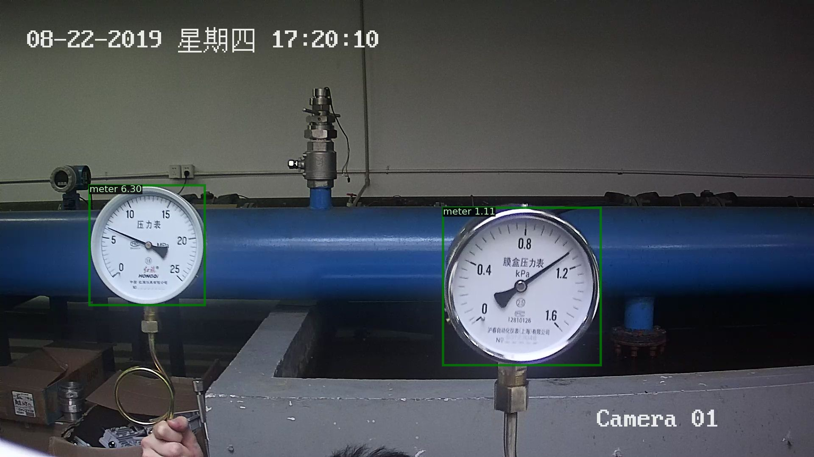
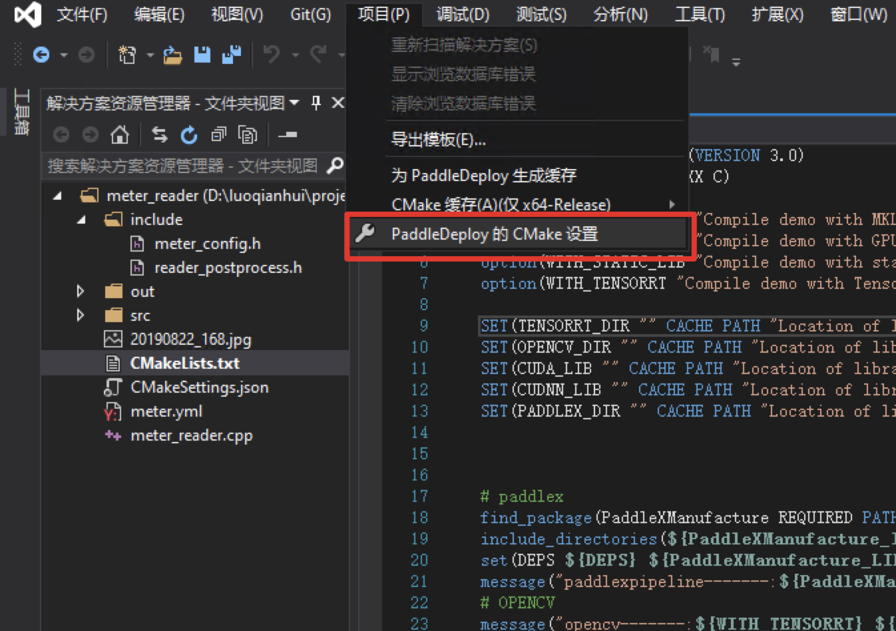
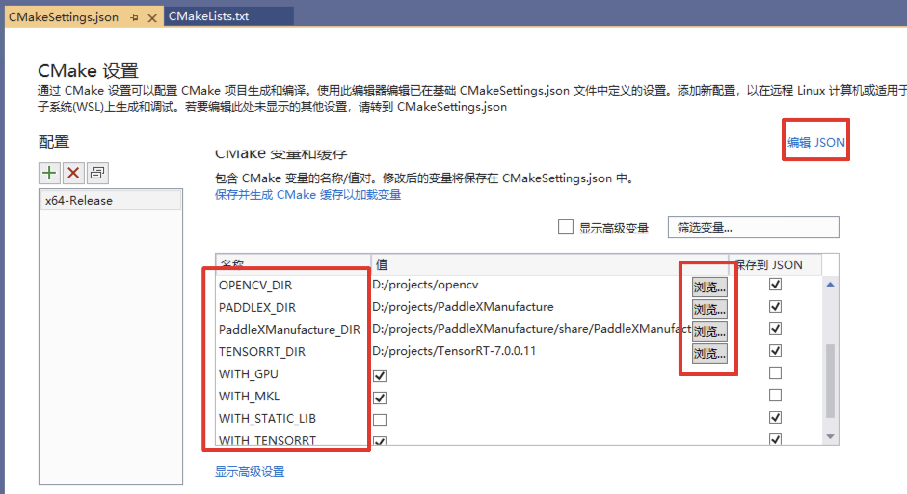
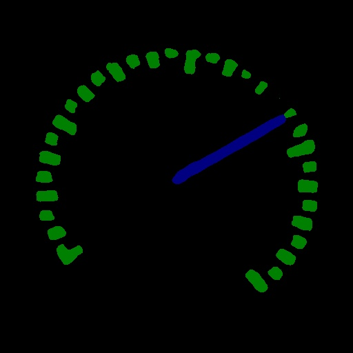

# 工业指针型表计读数

## 目录

* [1 项目说明](#1)
* [2 数据准备](#2)
* [3 模型选择](#3)
* [4 表计检测模型训练](#4)
* [5 指针和刻度分割模型训练](#5)
* [6 模型预测](#6)
* [7 模型导出](#7)
* [8 Windows环境下模型部署](#8)

## <h2 id="1">1 项目说明</h2>

在该项目中，主要向大家介绍如何使用目标检测和语义分割来实现对指针型表计读数。

在电力能源厂区需要定期监测表计读数，以保证设备正常运行及厂区安全。但厂区分布分散，人工巡检耗时长，无法实时监测表计，且部分工作环境危险导致人工巡检无法触达。针对上述问题，希望通过摄像头拍照->智能读数的方式高效地完成此任务。

<div align="center">
              </div>

为实现智能读数，我们采取目标检测->语义分割->读数后处理的方案：

* 第一步，使用目标检测模型定位出图像中的表计；
* 第二步，使用语义分割模型将各表计的指针和刻度分割出来；
* 第三步，根据指针的相对位置和预知的量程计算出各表计的读数。

整个方案的流程如下所示：

<div align="center">
              </div>


## <h2 id="2">2 数据准备</h2>

本案例开放了表计检测数据集、指针和刻度分割数据集、表计测试图片（只有图片无真值标注），使用这些图片可以完成目标检测模型、语义分割模型的训练、模型预测。点击下表中的链接可下载数据集，**提前下载数据集不是必须的，因为在接下来的模型训练部分中提供的训练脚本会自动下载数据集**。

| 表计测试图片                                                 | 表计检测数据集                                               | 指针和刻度分割数据集                                         |
| ------------------------------------------------------------ | ------------------------------------------------------------ | ------------------------------------------------------------ |
| [meter_test](https://bj.bcebos.com/paddlex/examples/meter_reader/datasets/meter_test.tar.gz) | [meter_det](https://bj.bcebos.com/paddlex/examples/meter_reader/datasets/meter_det.tar.gz) | [meter_seg](https://bj.bcebos.com/paddlex/examples/meter_reader/datasets/meter_seg.tar.gz) |

| 表计检测数据集 | 指针和刻度分割数据集 |
| -- | -- |
|  |  |


* 解压后的表计检测数据集的文件夹内容如下：

训练集有725张图片，测试集有58张图片。

```
meter_det/
|-- annotations/ # 标注文件所在文件夹
|   |-- instance_train.json # 训练集标注文件
|   |-- instance_test.json # 测试集标注文件
|-- test/ # 测试图片所在文件夹
|   |-- 20190822_105.jpg # 测试集图片
|   |-- ... ...
|-- train/ # 训练图片所在文件夹
|   |-- 20190822_101.jpg # 训练集图片
|   |-- ... ...

```

* 解压后的指针和刻度分割数据集的文件夹内容如下：

训练集有374张图片，测试集有40张图片。

```
meter_seg/
|-- annotations/ # 标注文件所在文件夹
|   |-- train # 训练集标注图片所在文件夹
|   |   |-- 105.png
|   |   |-- ... ...
|   |-- val # 验证集合标注图片所在文件夹
|   |   |-- 110.png
|   |   |-- ... ...
|-- images/ # 图片所在文件夹
|   |-- train # 训练集图片
|   |   |-- 105.jpg
|   |   |-- ... ...
|   |-- val # 验证集图片
|   |   |-- 110.jpg
|   |   |-- ... ...
|-- labels.txt # 类别名列表
|-- train.txt # 训练集图片列表
|-- val.txt # 验证集图片列表

```

* 解压后的表计测试图片的文件夹内容如下:

一共有58张测试图片。

```
meter_test/
|-- 20190822_105.jpg
|-- 20190822_142.jpg
|-- ... ...
```

## <h2 id="3">3 模型选择</h2>

PaddleX提供了丰富的视觉模型，在目标检测中提供了RCNN和YOLO系列模型，在语义分割中提供了DeepLabV3P和BiSeNetV2等模型。

因最终部署场景是本地化的服务器GPU端，算力相对充足，因此在本项目中采用精度和预测性能皆优的PPYOLOV2进行表计检测。

考虑到指针和刻度均为细小区域，我们采用精度更优的DeepLabV3P进行指针和刻度的分割。

## <h2 id="4">4 表计检测模型训练</h2>

本项目中采用精度和预测性能的PPYOLOV2进行表计检测。具体代码请参考[train_detection.py](./train_detection.py)。

运行如下代码开始训练模型：

```shell
python train_detection.py
```
训练结束后，最优模型精度`bbox_mmap`达到100%。

训练过程说明:

定义数据预处理 -> 定义数据集路径 -> 初始化模型 -> 模型训练

 * 定义数据预处理

```python
train_transforms = T.Compose([
    T.MixupImage(mixup_epoch=250), T.RandomDistort(),
    T.RandomExpand(im_padding_value=[123.675, 116.28, 103.53]), T.RandomCrop(),
    T.RandomHorizontalFlip(), T.BatchRandomResize(
        target_sizes=[320, 352, 384, 416, 448, 480, 512, 544, 576, 608],
        interp='RANDOM'), T.Normalize(
            mean=[0.485, 0.456, 0.406], std=[0.229, 0.224, 0.225])
])

eval_transforms = T.Compose([
    T.Resize(
        608, interp='CUBIC'), T.Normalize(
            mean=[0.485, 0.456, 0.406], std=[0.229, 0.224, 0.225])
])
```


 * 定义数据集路径

```python

# 下载和解压表计检测数据集，如果已经预先下载，可注释掉下面两行
meter_det_dataset = 'https://bj.bcebos.com/paddlex/examples/meter_reader/datasets/meter_det.tar.gz'
pdx.utils.download_and_decompress(meter_det_dataset, path='./')

train_dataset = pdx.datasets.CocoDetection(
    data_dir='meter_det/train/',
    ann_file='meter_det/annotations/instance_train.json',
    transforms=train_transforms,
    shuffle=True)
eval_dataset = pdx.datasets.CocoDetection(
    data_dir='meter_det/test/',
    ann_file='meter_det/annotations/instance_test.json',
    transforms=eval_transforms)
```

 * 初始化模型

```python
num_classes = len(train_dataset.labels)
model = pdx.det.PPYOLOv2(
    num_classes=num_classes, backbone='ResNet50_vd_dcn')

```

* 模型训练

```python
model.train(
    num_epochs=170,
    train_dataset=train_dataset,
    train_batch_size=8,
    eval_dataset=eval_dataset,
    pretrain_weights='COCO',
    learning_rate=0.005 / 12,
    warmup_steps=1000,
    warmup_start_lr=0.0,
    lr_decay_epochs=[105, 135, 150],
    save_interval_epochs=5,
    save_dir='output/ppyolov2_r50vd_dcn',
    use_vdl=True)
```

## <h2 id="5">5 指针和刻度分割模型训练</h2>

本项目中采用精度更优的DeepLabV3P进行指针和刻度的分割。具体代码请参考[train_segmentation.py](./train_segmentation.py)。

运行如下代码开始训练模型：

```shell
python train_segmentation.py
```

训练结束后，最优模型精度`miou`达84.09。

训练过程说明:

定义数据预处理 -> 定义数据集路径 -> 初始化模型 -> 模型训练

* 定义数据预处理

```python
train_transforms = T.Compose([
    T.Resize(target_size=512),
    T.RandomHorizontalFlip(),
    T.Normalize(
        mean=[0.5, 0.5, 0.5], std=[0.5, 0.5, 0.5]),
])

eval_transforms = T.Compose([
    T.Resize(target_size=512),
    T.Normalize(
        mean=[0.5, 0.5, 0.5], std=[0.5, 0.5, 0.5]),
])
```


* 定义数据集路径

```python
# 下载和解压指针刻度分割数据集，如果已经预先下载，可注释掉下面两行
meter_seg_dataset = 'https://bj.bcebos.com/paddlex/examples/meter_reader/datasets/meter_seg.tar.gz'
pdx.utils.download_and_decompress(meter_seg_dataset, path='./')

train_dataset = pdx.datasets.SegDataset(
    data_dir='meter_seg',
    file_list='meter_seg/train.txt',
    label_list='meter_seg/labels.txt',
    transforms=train_transforms,
    shuffle=True)

eval_dataset = pdx.datasets.SegDataset(
    data_dir='meter_seg',
    file_list='meter_seg/val.txt',
    label_list='meter_seg/labels.txt',
    transforms=eval_transforms,
    shuffle=False)

```

* 初始化模型

```python
num_classes = len(train_dataset.labels)
model = pdx.seg.DeepLabV3P(num_classes=num_classes, backbone='ResNet50_vd', use_mixed_loss=True)

```

* 模型训练

```python
model.train(
    num_epochs=20,
    train_dataset=train_dataset,
    train_batch_size=4,
    pretrain_weights='IMAGENET',
    eval_dataset=eval_dataset,
    learning_rate=0.1,
    save_dir='output/deeplabv3p_r50vd')
```

## <h2 id="6">6 模型预测</h2>

运行如下代码：

```shell
python reader_infer.py --det_model_dir output/ppyolov2_r50vd_dcn/best_model --seg_model_dir output/deeplabv3p_r50vd/best_model/ --image meter_det/test/20190822_105.jpg
```

则会在终端上输出信息：

```
Meter 1: 6.299999866666726
Meter 2: 1.1057142840816332
2021-06-26 12:17:14 [INFO]  The visualized result is saved at ./output/result/visualize_1624709834720.jpg

```
预测结果如下：

<div align="center">
              </div>

我们看下预测代码中的预测流程：

图像解码 —> 检测表计 -> 过滤检测框 -> 提取检测框所在图像区域 -> 图像缩放 -> 指针和刻度分割 -> 读数后处理 -> 打印读数 -> 可视化预测结果

```python
def predict(self,
            img_file,
            save_dir='./',
            use_erode=True,
            erode_kernel=4,
            score_threshold=0.5,
            seg_batch_size=2):
    """检测图像中的表盘，而后分割出各表盘中的指针和刻度，对分割结果进行读数后处理后得到各表盘的读数。

        参数：
            img_file (str)：待预测的图片路径。
            save_dir (str): 可视化结果的保存路径。
            use_erode (bool, optional): 是否对分割预测结果做图像腐蚀。默认值：True。
            erode_kernel (int, optional): 图像腐蚀的卷积核大小。默认值: 4。
            score_threshold (float, optional): 用于滤除检测框的置信度阈值。默认值：0.5。
            seg_batch_size (int, optional)：分割模型前向推理一次时输入表盘图像的批量大小。默认值为：2。
    """

    img = self.decode(img_file)
    det_results = self.detector.predict(img)
    filtered_results = self.filter_bboxes(det_results, score_threshold)
    sub_imgs = self.roi_crop(img, filtered_results)
    sub_imgs = self.resize(sub_imgs, METER_SHAPE)
    seg_results = self.seg_predict(self.segmenter, sub_imgs, seg_batch_size)
    seg_results = self.erode(seg_results, erode_kernel)
    meter_readings = self.get_meter_reading(seg_results)
    self.print_meter_readings(meter_readings)
    self.visualize(img, filtered_results, meter_readings, save_dir)

```

## <h2 id="7">7 模型导出</h2>

在训练过程中模型被保存在了`output`文件夹，此时模型格式还是动态图格式，需要导出成静态图格式才可以进行下一步部署。

运行如下命令将表计检测模型导出，会自动在`meter_det_model`文件夹下创建一个`inference_model`的文件夹，用来存放静态图格式的检测模型。

```python

paddlex --export_inference --model_dir=output/ppyolov2_r50vd_dcn/best_model --save_dir=meter_det_model

```

运行如下命令将刻度和指针分割模型导出，会自动在`meter_seg_model`文件夹下创建一个`inference_model`的文件夹，用来存放静态图格式的分割模型。

```python

paddlex --export_inference --model_dir=output/deeplabv3p_r50vd/best_model --save_dir=meter_seg_model
```

如果部署时需要使用TensorRT，导出模型的时候需要固定模型的输入大小，具体导出流程参考[部署模型导出](https://github.com/PaddlePaddle/PaddleX/blob/develop/docs/apis/export_model.md)。

## <h2 id="8">8 Windows环境下模型部署</h2>

我们在上一步已经将模型导出为静态图格式了，现在可以开始部署了。如果不想运行前面的训练步骤，也可以下载我们训练好并已经导出成静态图格式的模型进行下面的部署流程：

| 表计检测预训练模型 | 刻度和指针分割预训练模型 |
| -- | -- |
| [meter_det_model](https://bj.bcebos.com/paddlex/examples2/meter_reader/meter_det_model.tar.gz) | [meter_seg_model](https://bj.bcebos.com/paddlex/examples2/meter_reader//meter_seg_model.tar.gz) |


这里我们基于[PaddleX Manufature SDK](https://github.com/PaddlePaddle/PaddleX/tree/develop/deploy/cpp/docs/manufacture_sdk)进行部署。

### 环境依赖

* Visual Studio 2019
* CUDA 10.2, CUDNN 7.6
* CMake 3.0+

### 编译步骤

**下面所有示例以工作目录为 `D:\projects`演示。**

### Step1: 下载工业表计读数部署代码

```shell
d:
mkdir projects
cd projects
git clone https://github.com/PaddlePaddle/PaddleX.git
cd PaddleX
git checkout develop

```
### Step2: 下载PaddleX Manufature SDK

点击链接下载适用Windows 10平台CUDA 10.2/CUDNN 7.6的[PaddleXManufature.tar](https://bj.bcebos.com/paddlex/examples2/manufacture_sdk//PaddleXManufacture_win64_210_cuda102_cudnn76_trt70.zip )。

将SDK解压后，其所在目录（例如`D:\projects\PaddleXManufature\`）下主要包含的内容有：

```
├── \include\ # paddlex deploy核心库和头文件
|
├── \lib\ #
|
├── \share\ #
|
├── \third_party\ # 第三方依赖库和头文件
|
└── \version.txt # 版本和编译信息
```

### Step3: 安装配置OpenCV

1. 在OpenCV官网下载适用于Windows平台的3.4.6版本  [下载地址](https://bj.bcebos.com/paddleseg/deploy/opencv-3.4.6-vc14_vc15.exe)  
2. 运行下载的可执行文件，将OpenCV解压至指定目录，例如`D:\projects\opencv`
3. 配置环境变量，如下流程所示  
   - 我的电脑->属性->高级系统设置->环境变量
   - 在系统变量中找到Path（如没有，自行创建），并双击编辑
   - 新建，将opencv路径填入并保存，如`D:\projects\opencv\build\x64\vc15\bin`
   - 在进行cmake构建时，会有相关提示，请注意vs2019的输出

### Step4: 下载TensorRT

1. 在英伟达官网下载适用于Windows平台CUDA 10.2, CUDNN 7版本的TensorRT-7.0.0.11
2. 将TensorRT解压至指定目录，例如`D:\projects\TensorRT-7.0.0.11`

### Step5: 使用Visual Studio 2019直接编译CMake

1. 打开Visual Studio 2019 Community，点击`继续但无需代码`
   

2. 点击： `文件`->`打开`->`CMake`


选择表计读数C++预测代码所在路径（例如`D:\projects\PaddleX\examples/meter_reader/deploy/cpp/meter_reader`），并打开`CMakeList.txt`：


3. 打开项目时，可能会自动构建。由于没有进行下面的依赖路径设置会报错，这个报错可以先忽略。

  点击：`项目`->`CMake设置`
  

4. 点击`浏览`，分别设置编译选项指定`CUDA`、`OPENCV_DIR`、`PADDLEX_DIR`、`PaddleXManufacture_DIR`、`TensorRT`的路径（也可以点击右上角的“编辑 JSON”，直接修改json文件，然后保存点 项目->生成缓存）
   
   依赖库路径的含义说明如下（带*表示仅在使用**GPU版本**预测库时指定, 其中CUDA库版本与PaddleXManufacture的对齐，例如PaddleXManufacture是**使用9.0、10.0版本**编译的，则编译PaddleX预测代码时**不使用9.2、10.1等版本**CUDA库）：

| 参数名     | 含义                                                                                                                                                |
| ---------- | --------------------------------------------------------------------------------------------------------------------------------------------------- |
| CUDA_LIB  | CUDA的库路径, 注：请将CUDNN的cudnn.lib文件拷贝到CUDA_LIB路径下。<br />例如 `C:\\Program Files\\NVIDIA GPU Computing Toolkit\\CUDA\\v10.2\\lib\\x64` |
| OPENCV_DIR | OpenCV的安装路径，例如`D:\\projects\\opencv`                                                                                                        |
| PADDLEX_DIR | PaddleXManufacture的路径，例如 `D:\\projects\\PaddleXManufacture` |
| PaddleXManufacture_DIR | PaddleXManufacture的config.cmake所在路径，例如 `D:\\projects\\PaddleXManufacture\\share\\PaddleXManufacture`                                                                           |
| TENSORRT_DIR | PaddleXManufacture的路径，例如 `D:\\projects\\TensorRT-7.0.0.11`                                                                           |

- 如果使用`CPU`版预测库，请把`WITH_GPU`的`值`去掉勾
- **`WITH_TENSORRT`的`值`必须打上勾**

5. 保存并生成CMake缓存

**设置完成后**, CTRL+C保存。然后我们可以看到vs的输出会打印CMake生成的过程，出现`CMake 生成完毕`且无报错代表生成完毕。

6. 点击`项目`->`全部生成`，生成meter_reader里的可执行文件。


### Step6: 编译结果

编译后会在`D:\projects\PaddleX\examples\meter_reader\out\build\x64-Release`目录下生成`meter_reader.exe`二进制文件。

使用PaddleXManufacture所需要的流程配置文件位于`PaddleX\examples\meter_reader\meter_pipeline.yml`，打开该配置文件，修改检测模型和分割模型所在路径:

| 修改检测模型所在路径，并设置`use_gpu`和`use_trt`为true | 修改分割模型所在路径，并设置`use_gpu`和`use_trt`为true |
| -- | -- |
|  |  |

**模型所在路径是我们在上一步导出的模型模型所在路径**

打开CMD终端，运行表计读数的可执行文件，进行推理预测：
```
cd PaddleX\examples\meter_reader\deploy\cpp\meter_reader\
.\out\build\x64-Release\meter_reader.exe --pipeline_cfg meter_pipeline.yml --image 20190822_168.jpg
```
执行后终端会输出预测结果：

```
save_dir: ./output_det does not exists. This path will be created automatically.
save_dir: ./output_seg does not exists. This path will be created automatically.
Box(0   meter   0.98431444      656.26440430    451.94650269    224.40563965    230.18161011)
Box(0   meter   0.98169208      1374.56347656   529.34149170    284.29077148    291.98461914)
ScoreMask(mean: 13.08305625     std:    44.50118578)    LabelMask(mean: 0.10153198      std:    0.18212054)
Meter 1: 1.05576932
Meter 2: 6.21739101
```

在检测模型可视化的预测结果保存在`PaddleX\examples\meter_reader\deploy\cpp\meter_reader\out\build\x64-Release\output_det`，可以点击进行查看：


在分割模型可视化的预测结果保存在`PaddleX\examples\meter_reader\deploy\cpp\meter_reader\out\build\x64-Release\output_seg`，可以点击进行查看：
| 表1可视化分割结果 | 表2可视化分割结果|
| -- | -- |
|  |  |
