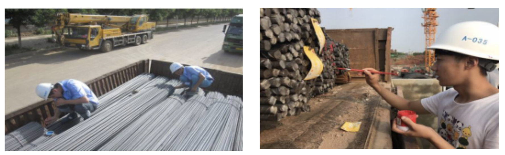

# 钢筋计数


### 1 项目说明
在该项目中，主要向大家介绍如何使用目标检测来实现对钢筋计数。涉及代码亦可用于车辆计数、螺母计数、圆木计数等。

在工地现场，对于进场的钢筋车，验收人员需要对车上的钢筋进行现场人工点根，确认数量后钢筋车才能完成进场卸货。上述过程繁琐、消耗人力且速度很慢。针对上述问题，希望通过手机拍照->目标检测计数->人工修改少量误检的方式智能、高效的完成此任务：
<div align="center">
              </div>

**业务难点：**
* **精度要求高** 钢筋本身价格较昂贵，且在实际使用中数量很大，误检和漏检都需要人工在大量的标记点中找出，所以需要精度非常高才能保证验收人员的使用体验。需要专门针对此密集目标的检测算法进行优化，另外，还需要处理拍摄角度、光线不完全受控，钢筋存在长短不齐、可能存在遮挡等情况。
* **钢筋尺寸不一** 钢筋的直径变化范围较大且截面形状不规则、颜色不一，拍摄的角度、距离也不完全受控，这也导致传统算法在实际使用的过程中效果很难稳定。
* **边界难以区分** 一辆钢筋车一次会运输很多捆钢筋，如果直接全部处理会存在边缘角度差、遮挡等问题效果不好，目前在用单捆处理+最后合计的流程，这样的处理过程就会需要对捆间进行分割或者对最终结果进行去重，难度较大。

<div align="center">
              </div>

### 2 数据准备

数据集中包含了250张已经标注好的数据，原始数据标注形式为csv格式。该项目采用目标检测的标注方式，在本文档中提供了VOC数据集格式。[点击此处下载数据集]( https://bj.bcebos.com/paddlex/examples2/rebar_count/dataset_reinforcing_steel_bar_counting.zip)

更多数据格式信息请参考[数据标注说明文档](./../../docs/data/annotation/README.md)

* **数据切分**
将训练集、验证集和测试集按照7：2：1的比例划分。 PaddleX中提供了简单易用的API，方便用户直接使用进行数据划分。
``` shell
paddlex --split_dataset --format VOC --dataset_dir dataset --val_value 0.2 --test_value 0.1
```
<div align="center">
              </div>
数据文件夹切分前后的状态如下:

```bash
  dataset/                          dataset/
  ├── Annotations/      -->         ├── Annotations/
  ├── JPEGImages/                   ├── JPEGImages/
                                    ├── labels.txt
                                    ├── test_list.txt
                                    ├── train_list.txt
                                    ├── val_list.txt
  ```

### 3 模型选择
PaddleX提供了丰富的视觉模型，在目标检测中提供了RCNN和YOLO系列模型。在本项目中采用yoloV3作为检测模型进行钢筋计数。

### 4 模型训练
在项目中，我们采用yolov3作为钢筋检测的模型。具体代码请参考[train.py](./code/train.py)。

运行如下代码开始训练模型：


``` shell
python code/train.py
```

若输入如下代码，则可在log文件中查看训练日志，log文件保存在`code`目标下
``` shell
python code/train.py > log
```

* 训练过程说明
<div align="center">
              </div>

``` bash
# 定义训练和验证时的transforms
# API说明：https://github.com/PaddlePaddle/PaddleX/blob/release/2.0-rc/paddlex/cv/transforms/operators.py
train_transforms = T.Compose([
    T.MixupImage(mixup_epoch=250), T.RandomDistort(),
    T.RandomExpand(im_padding_value=[123.675, 116.28, 103.53]), T.RandomCrop(),
    T.RandomHorizontalFlip(), T.BatchRandomResize(
        target_sizes=[320, 352, 384, 416, 448, 480, 512, 544, 576, 608],
        interp='RANDOM'), T.Normalize(
            mean=[0.485, 0.456, 0.406], std=[0.229, 0.224, 0.225])
])

eval_transforms = T.Compose([
    T.Resize(
        608, interp='CUBIC'), T.Normalize(
            mean=[0.485, 0.456, 0.406], std=[0.229, 0.224, 0.225])
])
```

```bash
# 定义训练和验证所用的数据集
# API说明：https://github.com/PaddlePaddle/PaddleX/blob/release/2.0-rc/paddlex/cv/datasets/voc.py#L29
train_dataset = pdx.datasets.VOCDetection(
    data_dir='dataset',
    file_list='dataset/train_list.txt',
    label_list='dataset/labels.txt',
    transforms=train_transforms,
    shuffle=True,
    num_worker=0)

eval_dataset = pdx.datasets.VOCDetection(
    data_dir='dataset',
    file_list='dataset/val_list.txt',
    label_list='dataset/labels.txt',
    transforms=eval_transforms,
    shuffle=False,
    num_worker=0)
```
``` bash
# 初始化模型，并进行训练
# 可使用VisualDL查看训练指标，参考https://github.com/PaddlePaddle/PaddleX/tree/release/2.0-rc/tutorials/train#visualdl可视化训练指标
num_classes = len(train_dataset.labels)
model = pdx.det.YOLOv3(num_classes=num_classes, backbone='DarkNet53')
```
``` bash
# API说明：https://github.com/PaddlePaddle/PaddleX/blob/release/2.0-rc/paddlex/cv/models/detector.py#L155
# 各参数介绍与调整说明：https://paddlex.readthedocs.io/zh_CN/develop/appendix/parameters.html
model.train(
    num_epochs=270,
    train_dataset=train_dataset,
    train_batch_size=2,
    eval_dataset=eval_dataset,
    learning_rate=0.001 / 8,
    warmup_steps=1000,
    warmup_start_lr=0.0,
    save_interval_epochs=5,
    lr_decay_epochs=[216, 243],
    save_dir='output/yolov3_darknet53')
 ```


### 5 训练可视化

在模型训练过程，在`train`函数中，将`use_vdl`设为True，则训练过程会自动将训练日志以VisualDL的格式打点在`save_dir`（用户自己指定的路径）下的`vdl_log`目录。

用户可以使用如下命令启动VisualDL服务，查看可视化指标

```
visualdl --logdir output/yolov3_darknet53/vdl_log --port 8001
```

<div align="center">
              </div>

服务启动后，按照命令行提示，使用浏览器打开 http://localhost:8001/
<div align="center">
              </div>

### 6 模型导出
模型训练后保存在output文件夹，如果要使用PaddleInference进行部署需要导出成静态图的模型,运行如下命令，会自动在output文件夹下创建一个`inference_model`的文件夹，用来存放导出后的模型。

``` bash
paddlex --export_inference --model_dir=output/yolov3_darknet53/best_model --save_dir=output/inference_model --fixed_input_shape=608,608
```
**注意**：设定 fixed_input_shape 的数值需与 eval_transforms 中设置的 target_size 数值上保持一致。
### 7 模型预测

运行如下代码：
``` bash
python code/infer.py
```
文件内容如下：
```bash
import glob
import numpy as np
import threading
import time
import random
import os
import base64
import cv2
import json
import paddlex as pdx

image_name = 'dataset/JPEGImages/6B898244.jpg'

model = pdx.load_model('output/yolov3_darknet53/best_model')

img = cv2.imread(image_name)
result = model.predict(img)

keep_results = []
areas = []
f = open('result.txt','a')
count = 0
for dt in np.array(result):
    cname, bbox, score = dt['category'], dt['bbox'], dt['score']
    if score < 0.5:
        continue
    keep_results.append(dt)
    count+=1
    f.write(str(dt)+'\n')
    f.write('\n')
    areas.append(bbox[2] * bbox[3])
areas = np.asarray(areas)
sorted_idxs = np.argsort(-areas).tolist()
keep_results = [keep_results[k]
                for k in sorted_idxs] if len(keep_results) > 0 else []
print(keep_results)
print(count)
f.write("the total number is :"+str(int(count)))
f.close()
pdx.det.visualize(image_name, result, threshold=0.5, save_dir='./output/yolov3_darknet53')
```

则可生成result.txt文件并显示预测结果图片，result.txt文件中会显示图片中每个检测框的位置、类别及置信度，并给出检测框的总个数，从而实现了钢筋自动计数。

预测结果如下：
<div align="center">
              </div>

### 8 模型裁剪

模型裁剪可以更好地满足在端侧、移动端上部署场景下的性能需求，可以有效得降低模型的体积，以及计算量，加速预测性能。PaddleX集成了PaddleSlim的基于敏感度的通道裁剪算法，用户可以在PaddleX的训练代码里轻松使用起来。

运行如下代码：
``` bash
python code/prune.py
```
裁剪过程说明：
``` bash
# 定义训练和验证时的transforms
# API说明：https://github.com/PaddlePaddle/PaddleX/blob/release/2.0-rc/paddlex/cv/transforms/operators.py
train_transforms = T.Compose([
    T.MixupImage(mixup_epoch=250), T.RandomDistort(),
    T.RandomExpand(im_padding_value=[123.675, 116.28, 103.53]), T.RandomCrop(),
    T.RandomHorizontalFlip(), T.BatchRandomResize(
        target_sizes=[320, 352, 384, 416, 448, 480, 512, 544, 576, 608],
        interp='RANDOM'), T.Normalize(
            mean=[0.485, 0.456, 0.406], std=[0.229, 0.224, 0.225])
])

eval_transforms = T.Compose([
    T.Resize(
        608, interp='CUBIC'), T.Normalize(
            mean=[0.485, 0.456, 0.406], std=[0.229, 0.224, 0.225])
])
```
``` bash
# 定义训练和验证所用的数据集
# API说明：https://github.com/PaddlePaddle/PaddleX/blob/release/2.0-rc/paddlex/cv/datasets/voc.py#L29
train_dataset = pdx.datasets.VOCDetection(
    data_dir='dataset',
    file_list='dataset/train_list.txt',
    label_list='dataset/labels.txt',
    transforms=train_transforms,
    shuffle=True)

eval_dataset = pdx.datasets.VOCDetection(
    data_dir='dataset',
    file_list='dataset/val_list.txt',
    label_list='dataset/labels.txt',
    transforms=eval_transforms,
    shuffle=False)
```
``` bash
# 加载模型
model = pdx.load_model('output/yolov3_darknet53/best_model')
```
``` bash
# Step 1/3: 分析模型各层参数在不同的剪裁比例下的敏感度
# API说明：https://github.com/PaddlePaddle/PaddleX/blob/95c53dec89ab0f3769330fa445c6d9213986ca5f/paddlex/cv/models/base.py#L352
model.analyze_sensitivity(
    dataset=eval_dataset,
    batch_size=1,
    save_dir='output/yolov3_darknet53/prune')
```
**注意**： 如果之前运行过该步骤，第二次运行时会自动加载已有的output/yolov3_darknet53/prune/model.sensi.data，不再进行敏感度分析。
``` bash
# Step 2/3: 根据选择的FLOPs减小比例对模型进行剪裁
# API说明：https://github.com/PaddlePaddle/PaddleX/blob/95c53dec89ab0f3769330fa445c6d9213986ca5f/paddlex/cv/models/base.py#L394
model.prune(pruned_flops=.2)
```
**注意**： 如果想直接保存剪裁完的模型参数，设置save_dir即可。但我们强烈建议对剪裁过的模型重新进行训练，以保证模型精度损失能尽可能少。
``` bash
# Step 3/3: 对剪裁后的模型重新训练
# API说明：https://github.com/PaddlePaddle/PaddleX/blob/release/2.0-rc/paddlex/cv/models/detector.py#L154
# 各参数介绍与调整说明：https://paddlex.readthedocs.io/zh_CN/develop/appendix/parameters.html
model.train(
    num_epochs=270,
    train_dataset=train_dataset,
    train_batch_size=8,
    eval_dataset=eval_dataset,
    learning_rate=0.001 / 8,
    warmup_steps=1000,
    warmup_start_lr=0.0,
    save_interval_epochs=5,
    lr_decay_epochs=[216, 243],
    pretrain_weights=None,
    save_dir='output/yolov3_darknet53/prune')
```
**注意**： 重新训练时需将pretrain_weights设置为None，否则模型会加载pretrain_weights指定的预训练模型参数。
