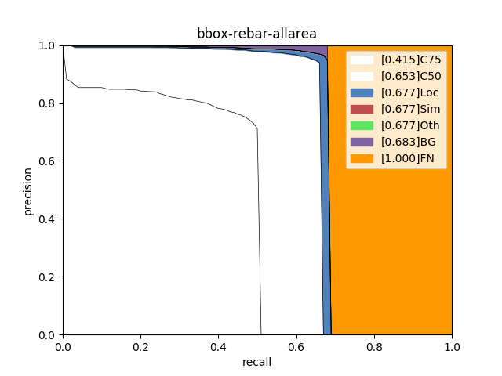
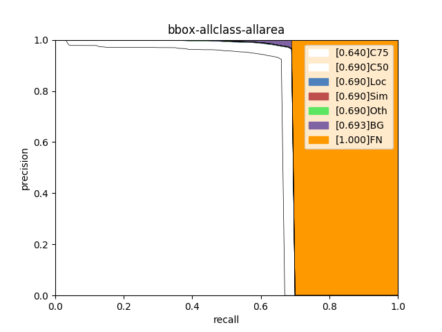

# 精度优化思路分析

本小节侧重展示在模型迭代过程中优化精度的思路，在本案例中，有些优化策略获得了精度收益，而有些没有。在其他场景中，可根据实际情况尝试这些优化策略。

## (1) 基线模型选择

相较于二阶段检测模型，单阶段检测模型的精度略低但是速度更快。考虑到是部署到GPU端，本案例选择单阶段检测模型YOLOV3作为基线模型，其骨干网络选择MobileNetV1。训练完成后，模型在验证集上的精度如下:

| 模型                                                         | 推理时间 （ms/image） | map(Iou-0.5) | (coco)mmap |
| ------------------------------------------------------------ | :-------------------: | ------------ | :--------: |
| **baseline: YOLOv3 - MobileNetV1+label_smooth=False +img_size(480)** |      **114.15**       | 65.3         |    38.3    |

## (2) 基线模型效果分析与优化

使用PaddleX提供的[paddlex.det.coco_error_analysis](https://paddlex.readthedocs.io/zh_CN/develop/apis/visualize.html#paddlex-det-coco-error-analysis)接口对模型在验证集上预测错误的原因进行分析，分析结果以图表的形式展示如下：

| 基线(移动端上线模型)                        | GPU端上线模型                               |
| ------------------------------------------- | ------------------------------------------- |
|  |  |

分析图表展示了7条Precision-Recall（PR）曲线，每一条曲线表示的Average Precision （AP）比它左边那条高，原因是逐步放宽了评估要求。以**基线**为例，各条PR曲线的评估要求解释如下：

- C75: 在IoU设置为0.75时的PR曲线, AP为0.415。
- C50: 在IoU设置为0.5时的PR曲线，AP为0.653。C50与C75之间的白色区域面积代表将IoU从0.75放宽至0.5带来的AP增益。
- Loc: 在IoU设置为0.1时的PR曲线，AP为0.677。Loc与C50之间的蓝色区域面积代表将IoU从0.5放宽至0.1带来的AP增益。蓝色区域面积越大，表示越多的检测框位置不够精准。
- Sim: 在Loc的基础上，如果检测框与真值框的类别不相同，但两者同属于一个亚类，则不认为该检测框是错误的，在这种评估要求下的PR曲线, AP为0.677。Sim与Loc之间的红色区域面积越大，表示子类间的混淆程度越高。VOC格式的数据集所有的类别都属于同一个亚类。
- Oth: 在Sim的基础上，如果检测框与真值框的亚类不相同，则不认为该检测框是错误的，在这种评估要求下的PR曲线，AP为0.677。Oth与Sim之间的绿色区域面积越大，表示亚类间的混淆程度越高。VOC格式的数据集中所有的类别都属于同一个亚类，故不存在亚类间的混淆。
- BG: 在Oth的基础上，背景区域上的检测框不认为是错误的，在这种评估要求下的PR曲线，AP为0.683。BG与Oth之间的紫色区域面积越大，表示背景区域被误检的数量越多。
- FN: 在BG的基础上，漏检的真值框不认为是错误的，在这种评估要求下的PR曲线，AP为1.00。FN与BG之间的橙色区域面积越大，表示漏检的真值框数量越多。

从分析图表中可以看出，移动端和GPU部署端检测效果都存在比较严重的漏检情况，此外在定位方面有较大的待提升空间。

通过移动端与GPU端模型的C75指标与C50指标的差距可以看出，通过使用更好的骨干网络会有利于模型进行学习特征以及定位。

正是考虑到漏检问题，实验中**采用ResNet34替换原有的MobileNetV1模型**，以及**输入图像适当放大**后，在指标上的提升如下:

| 模型                                                       | 推理时间 （ms/image） | map(Iou-0.5) | (coco)mmap |
| ---------------------------------------------------------- | :-------------------: | ------------ | :--------: |
| **YOLOv3 + ResNet50_vd_ssld + label_smooth=False + img_size(608)** |        120.44       | **69.0**     |  **49.7**  |

我们可以通过其误差分析图，得到以下优化结论:

    

- 通过骨干网络的更优替换，可以改善漏检情况：BG与FN的差值**从0.317降低到0.297**.
- 在对输入图片进一步放大: **480--608**，获得更多更准确的定位信息：C75**从0.415提升到0.619**.
- 同时，在这版优化实验中，可以发现误检指标明显下降: Oth与BG的差值**从0.005降低到0.001**.

> 因此，得到一个结论，对于存在较大漏检的模型时，主要先考虑两个优化方向：
>
> **1.替换更好的backbone。**
>
> **2.适当放大输入图像大小。**

本次实验基于Paddlex1.3.11进行训练，因此在骨干网络上的可选择性要少一些，但是大体上的优化思路确实可以在往后的Paddlex版本中进行延伸——特别是骨干网络方面。

PS：在YOLOV3中**目前的1.3.11版本没有ResNet50**，但是可以利用PPYOLO来实现，只需要关掉其中所有的优化策略与结构即可。（本次实验未进行该模型实验，理论上骨干网络更好，最终优化结果应该会更加理想。）

## (3) 数据增强选择

|             训练预处理1(a1)              |               验证预处理                |
| :--------------------------------------: | :-------------------------------------: |
|        MixupImage(mixup_epoch=-1)        | Resize(target_size=480, interp='CUBIC') |
|             RandomDistort()              |               Normalize()               |
|              RandomExpand()              |                                         |
|               RandomCrop()               |                                         |
| Resize(target_size=480, interp='RANDOM') |                                         |
|          RandomHorizontalFlip()          |                                         |
|               Normalize()                |                                         |

在加入了[RandomHorizontalFlip](https://paddlex.readthedocs.io/zh_CN/develop/apis/transforms/det_transforms.html#randomhorizontalflip)、[RandomDistort](https://paddlex.readthedocs.io/zh_CN/develop/apis/transforms/det_transforms.html#randomdistort)、[RandomCrop](https://paddlex.readthedocs.io/zh_CN/develop/apis/transforms/det_transforms.html#randomcrop)、[RandomExpand](https://paddlex.readthedocs.io/zh_CN/develop/apis/transforms/det_transforms.html#randomexpand)、[Resize](https://paddlex.readthedocs.io/zh_CN/develop/apis/transforms/det_transforms.html#resize)、[MixupImage](https://paddlex.readthedocs.io/zh_CN/develop/apis/transforms/det_transforms.html#mixupimage)这几种数据增强方法后，对模型的优化是有一定的积极作用了，在取消这些预处理后，模型性能会有一定的下降。

**PS**：建议在训练初期都加上这些预处理方法，到后期模型超参数以及相关结构确定最优之后，再进行数据方面的再优化: 比如数据清洗，数据预处理方法筛选等。

