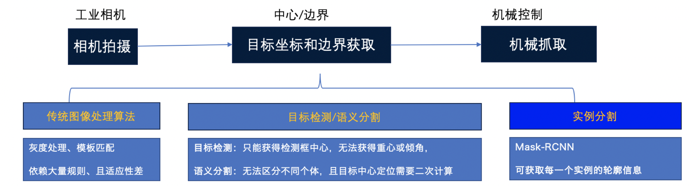
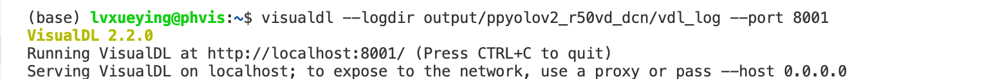

# 机械手抓取
### 1 项目说明
在生产过程中为了节省人工、提高加工效率，经常会用到自动化的抓取装置或机械手来代替人工操作。抓取的准确性很大程度上取决于视觉系统的识别准确性。

在2D视觉抓取中，能否获得目标物体精准的轮廓边缘将直接决定是否可以对目标进行准确的抓取。在本项目中，通过实例分割的方式对箱体中的目标进行边缘轮廓分割，引导机械手实现准确的抓取。

<div align="center">
              </div>

### 2 数据准备
数据集中提供了采用labelme进行多边形标注的30张图片。[点击此处下载数据集](https://bj.bcebos.com/paddlex/examples2/robot_grab/dataset_manipulator_grab.zip)

* **准备工作**

先指定路径到项目文件夹
``` shell
cd path_to_paddlexproject
```
建立`dataset_labelme`文件夹，在该文件夹下再分别建立`JPEGImages`和`Annotations`文件夹，将图片存放于`JPEGImages`文件夹，`Annotations`文件夹用于存储标注的json文件。

打开LabelMe，点击”Open Dir“按钮，选择需要标注的图像所在的文件夹打开，则”File List“对话框中会显示所有图像所对应的绝对路径，接着便可以开始遍历每张图像，进行标注工作.

更多数据格式信息请参考[数据标注说明文档](https://paddlex.readthedocs.io/zh_CN/develop/data/annotation/index.html)
* **目标边缘标注**

打开多边形标注工具（右键菜单->Create Polygon)以打点的方式圈出目标的轮廓，并在弹出的对话框中写明对应label（当label已存在时点击即可，此处请注意label勿使用中文），具体如下提所示，当框标注错误时，可点击左侧的“Edit Polygons”再点击标注框，通过拖拉进行修改，也可再点击“Delete Polygon”进行删除。

点击”Save“，将标注结果保存到中创建的文件夹`Annotations`目录中。
<div align="center">
              </div>

* **格式转换**

LabelMe标注后的数据还需要进行转换为MSCOCO格式，才可以用于实例分割任务的训练，创建保存目录`dataset`，在python环境中安装paddlex后，使用如下命令即可：
``` shell
paddlex --data_conversion --source labelme --to COCO --pics dataset_labelme/JPEGImages --annotations dataset_labelme/Annotations --save_dir dataset
```

* **数据切分**
将训练集、验证集和测试集按照7：2：1的比例划分。
``` shell
paddlex --split_dataset --format COCO --dataset_dir dataset --val_value 0.2 --test_value 0.1
```
<div align="center">
              </div>
数据文件夹切分前后的状态如下:

```bash
  dataset/                      dataset/
  ├── JPEGImages/       -->     ├── JPEGImages/
  ├── annotations.json          ├── annotations.json
                                ├── test.json
                                ├── train.json
                                ├── val.json
  ```


### 4 模型选择
PaddleX提供了丰富的视觉模型，在实例分割中提供了MaskRCNN系列模型，方便用户根据实际需要做选择。

### 5 模型训练
在项目中，我们采用MaskRCNN作为木块抓取的模型。具体代码请参考[train.py](./code/train.py)
运行如下代码开始训练模型：
``` shell
python code/train.py
```
若输入如下代码，则可在log文件中查看训练日志
``` shell
python code/train.py > log
```
* 训练过程说明
<div align="center">
              </div>

``` bash
# 定义训练和验证时的transforms
# API说明：https://github.com/PaddlePaddle/PaddleX/blob/release/2.0-rc/paddlex/cv/transforms/operators.py
train_transforms = T.Compose([
    T.RandomResizeByShort(
        short_sizes=[640, 672, 704, 736, 768, 800],
        max_size=1333,
        interp='CUBIC'), T.RandomHorizontalFlip(), T.Normalize(
            mean=[0.485, 0.456, 0.406], std=[0.229, 0.224, 0.225])
])

eval_transforms = T.Compose([
    T.ResizeByShort(
        short_size=800, max_size=1333, interp='CUBIC'), T.Normalize(
            mean=[0.485, 0.456, 0.406], std=[0.229, 0.224, 0.225])
])
```

```bash
# 定义训练和验证所用的数据集
# API说明：https://github.com/PaddlePaddle/PaddleX/blob/develop/paddlex/cv/datasets/coco.py#L26
train_dataset = pdx.datasets.CocoDetection(
    data_dir='dataset/JPEGImages',
    ann_file='dataset/train.json',
    transforms=train_transforms,
    shuffle=True)
eval_dataset = pdx.datasets.CocoDetection(
    data_dir='dataset/JPEGImages',
    ann_file='dataset/val.json',
    transforms=eval_transforms)
```
``` bash
# 初始化模型，并进行训练
# 可使用VisualDL查看训练指标，参考https://github.com/PaddlePaddle/PaddleX/tree/release/2.0-rc/tutorials/train#visualdl可视化训练指标
num_classes = len(train_dataset.labels)
model = pdx.models.MaskRCNN(
    num_classes=num_classes, backbone='ResNet50', with_fpn=True)
```
``` bash
# API说明：https://github.com/PaddlePaddle/PaddleX/blob/release/2.0-rc/paddlex/cv/models/detector.py#L155
# 各参数介绍与调整说明：https://paddlex.readthedocs.io/zh_CN/develop/appendix/parameters.html
model.train(
    num_epochs=12,
    train_dataset=train_dataset,
    train_batch_size=1,
    eval_dataset=eval_dataset,
    learning_rate=0.00125,
    lr_decay_epochs=[8, 11],
    warmup_steps=10,
    warmup_start_lr=0.0,
    save_dir='output/mask_rcnn_r50_fpn',
    use_vdl=True)
 ```

### 6 训练可视化

在模型训练过程，在`train`函数中，将`use_vdl`设为True，则训练过程会自动将训练日志以VisualDL的格式打点在`save_dir`（用户自己指定的路径）下的`vdl_log`目录。

用户可以使用如下命令启动VisualDL服务，查看可视化指标

```
visualdl --logdir output/mask_rcnn_r50_fpn/vdl_log --port 8001
```

<div align="center">
              </div>

服务启动后，按照命令行提示，使用浏览器打开 http://localhost:8001/

### 7 模型导出
模型训练后保存在output文件夹，如果要使用PaddleInference进行部署需要导出成静态图的模型,运行如下命令，会自动在output文件夹下创建一个`inference_model`的文件夹，用来存放导出后的模型。

``` bash
paddlex --export_inference --model_dir=output/mask_rcnn_r50_fpn/best_model --save_dir=output/inference_model
```

### 8 模型预测

运行如下代码：
``` bash
python code/infer.py
```
文件内容如下：
``` bash
import glob
import numpy as np
import threading
import time
import random
import os
import base64
import cv2
import json
import paddlex as pdx

image_name = 'dataset/JPEGImages/Image_20210615204210757.bmp'
model = pdx.load_model('output/mask_rcnn_r50_fpn/best_model')


img = cv2.imread(image_name)
result = model.predict(img)

keep_results = []
areas = []
f = open('result.txt','a')
count = 0
for dt in np.array(result):
    cname, bbox, score = dt['category'], dt['bbox'], dt['score']
    if score < 0.5:
        continue
    keep_results.append(dt)
    count+=1
    f.write(str(dt)+'\n')
    f.write('\n')
    areas.append(bbox[2] * bbox[3])
areas = np.asarray(areas)
sorted_idxs = np.argsort(-areas).tolist()
keep_results = [keep_results[k]
                for k in sorted_idxs] if len(keep_results) > 0 else []
print(keep_results)
print(count)
f.write("the total number is :"+str(int(count)))
f.close()

pdx.det.visualize(image_name, result, threshold=0.5, save_dir='./output/mask_rcnn_r50_fpn')
```
在目录中会生成result.txt文件和预测结果图片，result.txt文件中会显示图片中每个检测框的位置、类别及置信度，并给出检测框的总个数。

预测结果如下：
<div align="center">
              </div>
