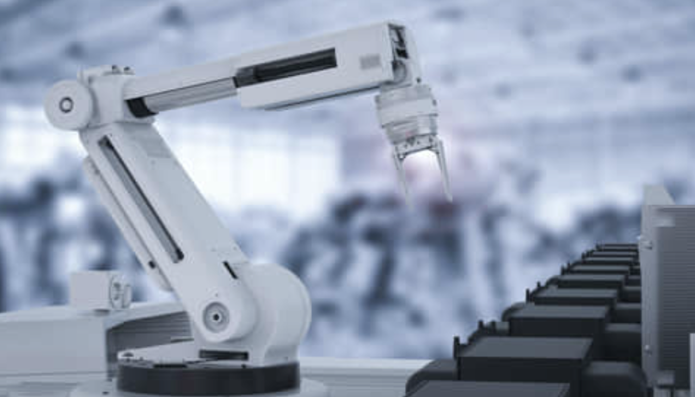
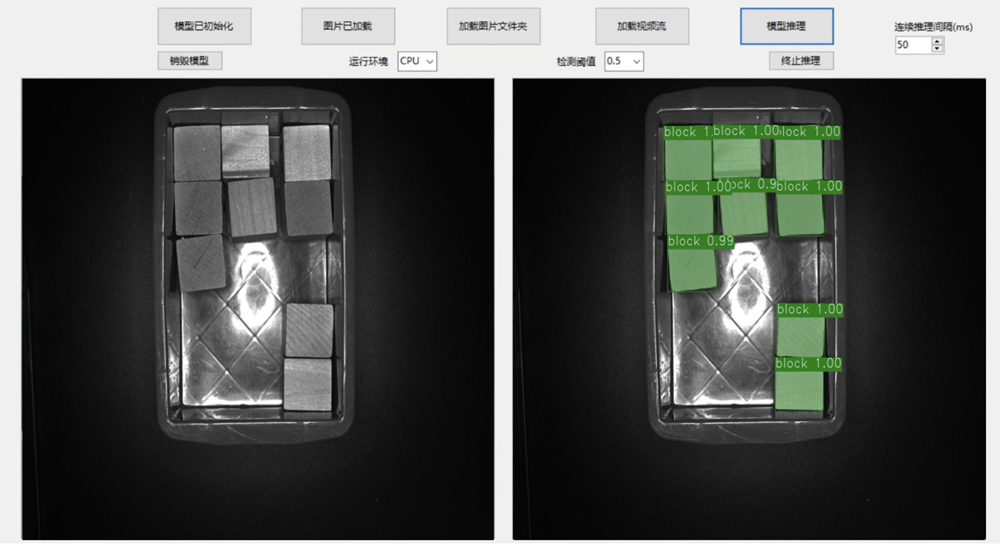

# 机械手抓取
### 1 项目说明
随着制造业的产线自动化、智能化需求的不断提升，机器人和AI视觉技术的结合越来越广泛，如：视觉引导的涂装、焊接或机械手抓取等。
<div align="center">
              </div>
在项目落地中，目标物体轮廓的精准定位非常关键。在视觉定位过程中，需要通过对相机的标定，来求取相机和实际物体的坐标关系，进而转化成机械手可以识别的坐标空间。但在实际场景中，目标所处的环境非常复杂，遨博机器人结合自身经验，总结出了一套深度学习抓取方案。


### 2 数据准备
数据集中提供了采用labelme进行多边形标注的30张图片。[点击此处下载数据集](https://bj.bcebos.com/paddlex/examples2/robot_grab/dataset_manipulator_grab.zip)

* **准备工作**

先指定路径到项目文件夹
``` shell
cd path_to_paddlexproject
```
建立`dataset_labelme`文件夹，在该文件夹下再分别建立`JPEGImages`和`Annotations`文件夹，将图片存放于`JPEGImages`文件夹，`Annotations`文件夹用于存储标注的json文件。

打开LabelMe，点击”Open Dir“按钮，选择需要标注的图像所在的文件夹打开，则”File List“对话框中会显示所有图像所对应的绝对路径，接着便可以开始遍历每张图像，进行标注工作.

更多数据格式信息请参考[数据标注说明文档](https://paddlex.readthedocs.io/zh_CN/develop/data/annotation/index.html)
* **目标边缘标注**

打开多边形标注工具（右键菜单->Create Polygon)以打点的方式圈出目标的轮廓，并在弹出的对话框中写明对应label（当label已存在时点击即可，此处请注意label勿使用中文），具体如下提所示，当框标注错误时，可点击左侧的“Edit Polygons”再点击标注框，通过拖拉进行修改，也可再点击“Delete Polygon”进行删除。

点击”Save“，将标注结果保存到中创建的文件夹`Annotations`目录中。
<div align="center">
              </div>

* **格式转换**

LabelMe标注后的数据还需要进行转换为MSCOCO格式，才可以用于实例分割任务的训练，创建保存目录`dataset`，在python环境中安装paddlex后，使用如下命令即可：
``` shell
paddlex --data_conversion --source labelme --to COCO --pics dataset_labelme/JPEGImages --annotations dataset_labelme/Annotations --save_dir dataset
```

* **数据切分**
将训练集、验证集和测试集按照7：2：1的比例划分。
``` shell
paddlex --split_dataset --format COCO --dataset_dir dataset --val_value 0.2 --test_value 0.1
```
<div align="center">
              </div>
数据文件夹切分前后的状态如下:

```bash
  dataset/                      dataset/
  ├── JPEGImages/       -->     ├── JPEGImages/
  ├── annotations.json          ├── annotations.json
                                ├── test.json
                                ├── train.json
                                ├── val.json
  ```


### 4 模型选择
实现抓取，模型的选择多种多样，最终选择了PaddleX提供的实例分割算法Mask RCNN

<div align="center">
              </div>


### 5 模型训练
在项目中，我们采用MaskRCNN作为木块抓取的模型。具体代码请参考[train.py](./code/train.py)
运行如下代码开始训练模型：
``` shell
python code/train.py
```
若输入如下代码，则可在log文件中查看训练日志
``` shell
python code/train.py > log
```
* 训练过程说明
<div align="center">
              </div>


### 6 训练可视化

在模型训练过程，在`train`函数中，将`use_vdl`设为True，则训练过程会自动将训练日志以VisualDL的格式打点在`save_dir`（用户自己指定的路径）下的`vdl_log`目录。

用户可以使用如下命令启动VisualDL服务，查看可视化指标

```
visualdl --logdir output/mask_rcnn_r50_fpn/vdl_log --port 8001
```

<div align="center">
              </div>

服务启动后，按照命令行提示，使用浏览器打开 http://localhost:8001/

### 7 模型导出
模型训练后保存在output文件夹，如果要使用PaddleInference进行部署需要导出成静态图的模型,运行如下命令，会自动在output文件夹下创建一个`inference_model`的文件夹，用来存放导出后的模型。

``` bash
paddlex --export_inference --model_dir=output/mask_rcnn_r50_fpn/best_model --save_dir=output/inference_model
```

### 8 模型预测

运行如下代码：
``` bash
python code/infer.py
```

预测结果如下：
<div align="center">
              </div>

### 9 边缘坐标的获取

进一步获取目标的，则可在log文件中查看训练日志
``` shell
python code/point.py > log
```
<div align="center">
              </div>

### 10 模型部署

模型部署采用了PaddleX提供的C++ inference部署方案，在该方案中提供了C#部署[Demo](https://github.com/PaddlePaddle/PaddleX/tree/develop/examples/C%23_deploy)，用户可根据实际情况自行参考修改。

<div align="center">
              </div>
