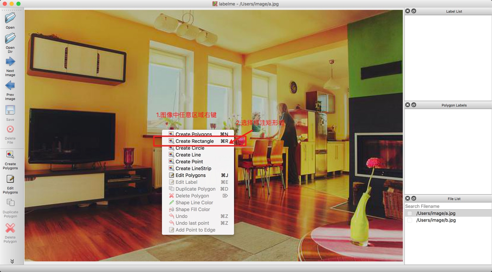

# 目标检测

目标检测数据的标注推荐使用LabelMe标注工具，如您先前并无安装，那么LabelMe的安装可参考[LabelMe安装和启动](labelme.md)

**注意：LabelMe对于中文支持不够友好，因此请不要在如下的路径以及文件名中出现中文字符!**

## 准备工作  

1. 将收集的图像存放于`JPEGImages`文件夹下，例如存储在`D:\MyDataset\JPEGImages`
2. 创建与图像文件夹相对应的文件夹`Annotations`，用于存储标注的json文件，如`D:MyDataset\Annotations`
3. 打开LabelMe，点击”Open Dir“按钮，选择需要标注的图像所在的文件夹打开，则”File List“对话框中会显示所有图像所对应的绝对路径，接着便可以开始遍历每张图像，进行标注工作  

## 目标框标注  

1. 打开矩形框标注工具(右键菜单->Create Rectangle)，具体如下图所示  


2. 使用拖拉的方式对目标物体进行标识，并在弹出的对话框中写明对应label（当label已存在时点击即可, 此处请注意label勿使用中文），具体如下图所示，当框标注错误时，可点击左侧的“Edit Polygons”再点击标注框，通过拖拉进行修改，也可再点击“Delete Polygon”进行删除。  


3. 点击右侧”Save“，将标注结果保存到中创建的文件夹Annotations目录中

## 格式转换

LabelMe标注后的数据还需要进行转换为PascalVOC或MSCOCO格式，才可以用于目标检测任务的训练，创建`D:\dataset_voc`目录，在python环境中安装paddlex后，使用如下命令即可
```
paddlex --data_conversion --source labelme --to PascalVOC \
        --pics D:\MyDataset\JPEGImages \
        --annotations D:\MyDataset\Annotations \
        --save_dir D:\dataset_voc
```

> 注：此文档中以LabelMe为示例，展示了格式转换，如您使用的是数据标注精灵工具，则可在标注完后，选择直接保存为PascalVOC格式

## 数据集划分

转换完数据后，为了进行训练，还需要将数据划分为训练集、验证集和测试集，同样在安装paddlex后，使用如下命令即可将数据划分为70%训练集，20%验证集和10%的测试集
```
paddlex --split_dataset --format VOC --dataset_dir D:\MyDataset --val_value 0.2 --test_value 0.1
```
执行上面命令行，会在`D:\MyDataset`下生成`labels.txt`, `train_list.txt`, `val_list.txt`和`test_list.txt`，分别存储类别信息，训练样本列表，验证样本列表，测试样本列表

> 注：如您使用PaddleX可视化客户端进行模型训练，数据集划分功能集成在客户端内，无需自行使用命令划分


- [目标检测任务训练示例代码](https://github.com/PaddlePaddle/PaddleX/blob/develop/tutorials/train/object_detection/yolov3_mobilenetv1.py)
