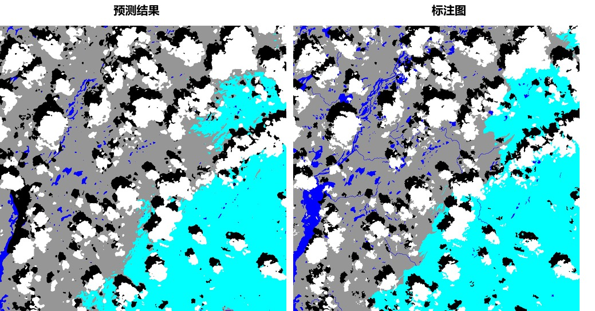

# 多通道遥感影像分割
遥感影像分割是图像分割领域中的重要应用场景，广泛应用于土地测绘、环境监测、城市建设等领域。遥感影像分割的目标多种多样，有诸如积雪、农作物、道路、建筑、水源等地物目标，也有例如云层的空中目标。

本案例基于PaddleX实现多通道遥感影像分割，涵盖数据分析、模型训练、模型预测等流程，旨在帮助用户利用深度学习技术解决多通道遥感影像分割问题。

## 目录
* [前置依赖](#1)
* [数据准备](#2)
* [数据分析](#3)
* [模型训练](#4)
* [模型预测](#5)

## <h2 id="1">前置依赖</h2>

* Paddle paddle >= 1.8.4
* Python >= 3.5
* PaddleX >= 1.1.4

安装的相关问题参考[PaddleX安装](../../docs/install.md)

**另外还需安装gdal**, 使用pip安装gdal可能出错，推荐使用conda进行安装：

```
conda install gdal
```

下载PaddleX源码:  

```  
git clone https://github.com/PaddlePaddle/PaddleX
```

该案例所有脚本均位于`PaddleX/examples/channel_remote_sensing/`，进入该目录：  

```
cd PaddleX/examples/channel_remote_sensing/  
```

##  <h2 id="2">数据准备</h2>

遥感影像的格式多种多样，不同传感器产生的数据格式也可能不同。PaddleX现已兼容以下4种格式图片读取：

- `tif`
- `png`, `jpeg`, `bmp`
- `img`
- `npy`

标注图要求必须为单通道的png格式图像，像素值即为对应的类别，像素标注类别需要从0开始递增。例如0，1，2，3表示有4种类别，255用于指定不参与训练和评估的像素，标注类别最多为256类。

本案例使用[L8 SPARCS公开数据集](https://www.usgs.gov/land-resources/nli/landsat/spatial-procedures-automated-removal-cloud-and-shadow-sparcs-validation)进行云雪分割，该数据集包含80张卫星影像，涵盖10个波段。原始标注图片包含7个类别，分别是`cloud`, `cloud shadow`, `shadow over water`, `snow/ice`, `water`, `land`和`flooded`。由于`flooded`和`shadow over water`2个类别占比仅为`1.8%`和`0.24%`，我们将其进行合并，`flooded`归为`land`，`shadow over water`归为`shadow`，合并后标注包含5个类别。

数值、类别、颜色对应表：

|Pixel value|Class|Color|
|---|---|---|
|0|cloud|white|
|1|shadow|black|
|2|snow/ice|cyan|
|3|water|blue|
|4|land|grey|

<p align="center">
 

<p align='center'>
 L8 SPARCS数据集示例
</p>

执行以下命令下载并解压经过类别合并后的数据集：
```shell script
mkdir dataset && cd dataset
wget https://paddleseg.bj.bcebos.com/dataset/remote_sensing_seg.zip
unzip remote_sensing_seg.zip
cd ..
```
其中`data`目录存放遥感影像，`data_vis`目录存放彩色合成预览图，`mask`目录存放标注图。

## <h2 id="2">数据分析</h2>  

遥感影像往往由许多波段组成，不同波段数据分布可能大相径庭，例如可见光波段和热红外波段分布十分不同。为了更深入了解数据的分布来优化模型训练效果，需要对数据进行分析。

参考文档[数据分析](./docs/analysis.md)对训练集进行统计分析，确定图像像素值的截断范围，并统计截断后的均值和方差。

## <h2 id="2">模型训练</h2>

本案例选择`UNet`语义分割模型完成云雪分割，运行以下步骤完成模型训练，模型的最优精度`miou`为`78.38%`。

* 设置GPU卡号
```shell script
export CUDA_VISIBLE_DEVICES=0
```

* 运行以下脚本开始训练
```shell script
python train.py --data_dir dataset/remote_sensing_seg \
--train_file_list dataset/remote_sensing_seg/train.txt \
--eval_file_list dataset/remote_sensing_seg/val.txt \
--label_list dataset/remote_sensing_seg/labels.txt \
--save_dir saved_model/remote_sensing_unet \
--num_classes 5 \
--channel 10 \
--lr 0.01 \
--clip_min_value 7172 6561 5777 5103 4291 4000 4000 4232 6934 7199 \
--clip_max_value 50000 50000 50000 50000 50000 40000 30000 18000 40000 36000 \
--mean 0.15163569 0.15142828 0.15574491 0.1716084  0.2799778  0.27652043 0.28195933 0.07853807 0.56333154 0.5477584 \
--std  0.09301891 0.09818967 0.09831126 0.1057784  0.10842132 0.11062996 0.12791838 0.02637859 0.0675052  0.06168227 \
--num_epochs 500 \
--train_batch_size 3
```

也可以跳过模型训练步骤，下载预训练模型直接进行模型预测：

```
wget https://bj.bcebos.com/paddlex/examples/multi-channel_remote_sensing/models/l8sparcs_remote_model.tar.gz
tar -xvf l8sparcs_remote_model.tar.gz
```

## <h2 id="2">模型预测</h2>
运行以下脚本，对遥感图像进行预测并可视化预测结果，相应地也将对应的标注文件进行可视化，以比较预测效果。

```shell script
export CUDA_VISIBLE_DEVICES=0
python predict.py
```
可视化效果如下所示:





数值、类别、颜色对应表：

|Pixel value|Class|Color|
|---|---|---|
|0|cloud|white|
|1|shadow|black|
|2|snow/ice|cyan|
|3|water|blue|
|4|land|grey|
