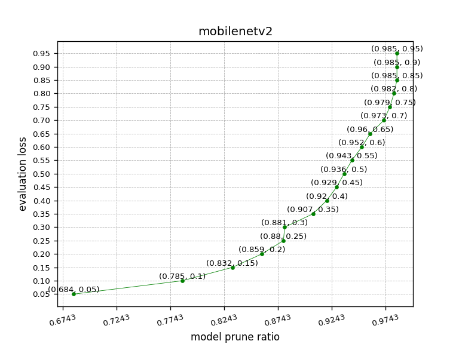

# 图像分类模型裁剪训练

## 第一步 正常训练图像分类模型

```
python mobilenetv2_train.py
```

在此步骤中，训练的模型会保存在`output/mobilenetv2`目录下

## 第二步 分析模型参数信息

```
python param_analysis.py
```
参数分析完后，会得到`mobilenetv2.sensi.data`文件，此文件保存了各参数的敏感度信息。  

> 我们可以继续加载模型和敏感度文件，进行可视化，如下命令所示
> ```
> python slim_visualize.py
> ```
> 可视化结果出下图
纵轴为`eval_metric_loss`(接下来第三步需要配置的参数)，横轴为模型被裁剪的比例，从图中可以看到，  
- 当`eval_metric_loss`设0.05时，模型被裁掉68.4%（剩余31.6%）  
- 当`eval_metric_loss`设0.1时，模型被裁掉78.5%（剩余21.5%）



## 第三步 模型进行裁剪训练

```
python mobilenetv2_prune_train.py
```
此步骤的代码与第一步的代码基本一致，唯一的区别是在最后的train函数中，`mobilenetv2_prune_train.py`修改了里面的`pretrain_weights`、`save_dir`、`sensitivities_file`和`eval_metric_loss`四个参数

- pretrain_weights: 在裁剪训练中，设置为之前训练好的模型
- save_dir: 模型训练过程中，模型的保存位置
- sensitivities_file: 在第二步中分析得到的参数敏感度信息文件
- eval_metric_loss: 第二步中可视化的相关参数，通过此参数可相应的改变最终模型被裁剪的比例


## 裁剪效果

在本示例数据上，裁剪效果对比如下，其中预测采用**CPU，关闭MKLDNN**进行预测，预测时间不包含数据的预处理和结果的后处理。  
可以看到在模型被裁剪掉64%后，模型精度还有上升，单张图片的预测用时减少了37%。


| 模型 | 参数文件大小 | 预测速度 | 准确率 |
| :--- | :----------  | :------- | :--- |
| MobileNetV2 |    8.7M       |   0.057s  | 0.92 |
| MobileNetV2(裁掉68%) | 2.8M | 0.036s | 0.99 |
